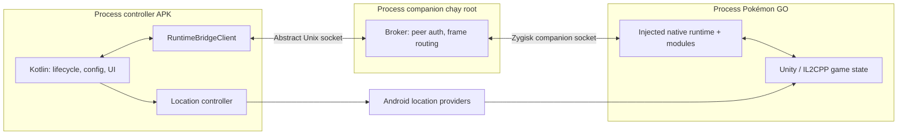

# Cấu trúc dự án và quy tắc phân chia trách nhiệm

Tài liệu này là mô tả cấu trúc hiện tại và rule đặt code cho
`pogo-root-automation`, đối chiếu source ngày 2026-09-22. Rule áp dụng cho agent
được dẫn từ [`AGENTS.md`](../AGENTS.md#project-structure-and-ownership-rules).

**Native sở hữu automation và logic runtime Pokémon GO. Kotlin sở hữu UI,
cấu hình, dữ liệu người dùng và fake-location controller trên Android.**
Mỗi hành động game chỉ có một nơi chịu trách nhiệm quyết định và thực thi.

Kotlin phục vụ overlay/UI **và xử lý fake location, joystick, teleport,
walk-to-location**. Kotlin không sở hữu điều phối runtime PoGo, diễn giải raw
game state hoặc state machine gameplay. `RuntimeUiAutomationFacade` chỉ gửi
desired snapshot và nhận trạng thái; `RuntimeUiEventRouter` chỉ route DTO/event
cho UI và location.

Client IPC, lưu setting/UI và lifecycle Android cần tách khỏi logic game.
`JoystickLocationController`, `WalkPlanner`/`GeoMath` và
`RootMockLocationProvider` tiếp tục được phép ở Kotlin; không cần chuyển
movement sang native theo rule mới. Runtime orchestration đã chuyển sang native;
storage và HTTP compatibility vẫn do app giữ.

Các mô tả cũ về `StructuredAutomationController → AutomationRunner` không còn
là luồng live của app. Đường live hiện tại là
`HeadlessAutomationService → RuntimeUiAutomationFacade → RuntimeUiClient`;
native tự readiness, reconcile config, module activation và gameplay. Một số
class coordinator/dispatcher cũ còn trong repository chỉ để phục vụ test
compatibility, không được service/API khởi tạo.

## 1. Cây thư mục

```text
pogo-root-automation/
├── zygisk/                         Native C++ và Magisk module
│   ├── jni/
│   │   ├── main.cpp                Ghép các đơn vị native bằng #include
│   │   ├── modules/                Logic theo tính năng
│   │   │   ├── core/              START / STOP / DIAGNOSTIC của runtime
│   │   │   ├── catch_spin/         Catch, spin, chọn target auto-walk
│   │   │   ├── encounter/          Encounter actions, berry, throw hooks
│   │   │   ├── discard/            Inventory và tự bỏ item theo config
│   │   │   └── transfer/           Lọc và transfer sau catch
│   │   ├── host/                  Công bố capability của runtime
│   │   ├── shared/
│   │   │   ├── core/              Bootstrap Zygisk, ELF probe, helper nền
│   │   │   ├── runtime/           IL2CPP services, observer, main-thread work
│   │   │   ├── bridge_appproc/    Kênh process game ↔ companion
│   │   │   └── bridge_kotlin/     Broker, wire protocol và kênh controller
│   │   └── third_party/           Header Zygisk
│   ├── module/                    Magisk metadata và lifecycle scripts
│   └── tests/                     Host-side native tests
├── app/                           APK controller Android
│   └── src/main/java/dev/pogoroot/automation/
│       ├── config/                Model config, repository và mapping wire
│       ├── data/                  Repository vị trí, favorites, map target
│       ├── service/               Foreground service, boot, HTTP control API
│       ├── engine/                Compatibility source cho test cũ
│       ├── runtime/               UI state, status/event router và compatibility
│       ├── root/                  RootShell, socket client, runtime diagnostics
│       ├── location/              Joystick/walk và Android mock location
│       ├── overlay/               Overlay, settings, toast và UI stores
│       ├── events/                Event model/sink phía app
│       └── scan/                  Kết quả scan trong bộ nhớ app
├── core/                          Domain Kotlin thuần, geo, walk, policy helpers
├── bridge/protocol/               Contract và codec Kotlin của IPC
├── game-adapter/
│   ├── api/                       Interface, capability và build model
│   ├── pogo/                      Decode payload/protobuf và map sang domain
│   └── fake/                      Adapter xác định cho development/tests
├── scripts/                       Build, package và thao tác device/emulator
├── docs/                          Kiến trúc, thiết kế và bằng chứng kiểm chứng
├── reverse/                       Reverse output sinh tự động, được ignore
└── pogo-apkm/                     APK đầu vào reverse, chỉ đọc
```

`app/` runtime chỉ phụ thuộc `core/` và `bridge/protocol/` (ngoài joystick AAR).
Các module `game-adapter/*` vẫn tồn tại để phục vụ adapter/test và compile
độc lập, nhưng không nằm trong dependency graph của APK controller.
`core/` không phụ thuộc Android hay native; `bridge/protocol/` giữ wire DTO và
codec của IPC. Native được build riêng qua CMake/NDK và script Magisk.

## 2. Native gồm gì, xử lý gì?

Native có hai phần chạy ở **hai tiến trình khác nhau**:

| Thành phần | Chạy ở đâu | Trách nhiệm |
|---|---|---|
| Injected runtime | Bên trong process Pokémon GO | Đọc game state, resolve/guard binding, điều phối feature và gọi API game |
| Zygisk companion/broker | Process root riêng | Xác thực controller, chuyển tiếp command/event, quản lý metadata của bridge và ghi diagnostics |

### Runtime trong game

- Nhận diện package/process/build/ABI; resolve Unity/IL2CPP, class, method,
  field và owner đã được kiểm chứng cho build tương ứng.
- Đọc state đang sống: map, nearby, encounter, inventory, player position và
  kết quả action. Chỉ native giữ pointer/handle của object game.
- Điều phối catch/spin/discard/transfer: chọn đối tượng theo config, kiểm tra
  điều kiện, tránh action xung đột, giữ pending state, theo dõi Promise/outcome,
  quản lý delay/cooldown và cập nhật state sau action.
- Quyết định target auto-walk đến fort, lúc đi/dừng/đến nơi; gửi intent sang
  Kotlin để thực hiện movement bằng Android location provider.
- Tự xử lý readiness và bật/tắt module từ config. Có module trong source không
  đồng nghĩa tính năng đã được phép chạy trên mọi game build.
- Phát observation, automation event, point-walk candidate và command result có cấu trúc.

### Rule đặt code native

1. Logic riêng của feature đặt trong `modules/<feature>/`: config trong RAM,
   parser, coordinator, executor và observer kết quả của feature đó.
2. Logic runtime dùng chung đặt trong `shared/runtime/`, chia theo trách nhiệm
   như `probe/`, `mainthread/`, `map/`, `inventory/`, `observation/`, `control/`
   và `module/`. Không đẩy policy riêng của feature vào broker hay `host/`.
3. `main.cpp` chỉ ghép các file. Hiện native là một translation unit dùng
   `.inc`; thứ tự include có dependency và phải được giữ đúng khi tách file.
4. Công việc cần Unity/main thread phải đi qua main-thread bridge hiện có.
   Không gọi managed object tùy ý từ thread socket/probe.
5. Companion xử lý IPC và diagnostics; quyết định gameplay thuộc runtime
   trong game, nơi có state và binding đã được kiểm chứng.
6. Guard về build, capability, lifecycle, object lifetime và freshness phải
   được giữ tại boundary. Thiếu guard/readiness thì fail closed.

## 3. Kotlin xử lý gì?

| Vùng code | Công việc |
|---|---|
| `app/config/` | Nhận lựa chọn người dùng, validate/lưu config, tăng revision và map thành payload gửi native |
| `app/service/` | Vòng đời service, API điều khiển, desired-state facade và báo trạng thái |
| `app/runtime/` | UI state và status/event router; candidate event được chuyển vào location coordinator |
| `app/root/` | `RuntimeUiClient`/`RuntimeBridgeClient`, root bootstrap/UID registration và IPC |
| `app/location/` | Admission/owner của walk candidate và thực hiện joystick, teleport, walk qua Android mock-location provider |
| `app/overlay/`, `app/events/`, `app/scan/` | Settings, overlay, toast, hiển thị event/kết quả và state UI |
| `app/data/` | Đọc/ghi dữ liệu app qua repository |
| `core/` | Model/action contract, geo math, `WalkPlanner` và tiện ích thuần không biết Android/game runtime |
| `bridge/protocol/` | Frame, message type, DTO, codec, session/sequence contract; không chứa quyết định gameplay |
| `game-adapter/api/` | Contract/capability không gắn với implementation |
| `game-adapter/pogo/` | Adapter PoGo riêng cho consumer ngoài app; không được import bởi UI-only service |
| `game-adapter/fake/` | Hành vi xác định phục vụ development/tests |

Các đường dẫn `app/<package>/` trong bảng là cách viết ngắn cho package dưới
`app/src/main/java/dev/pogoroot/automation/`.

Kotlin quyết định **người dùng muốn bật tính năng nào và cấu hình ra sao**.
Native quyết định **hành động game nào cần chạy tiếp dựa trên state hiện tại**.
Kotlin không thêm vòng scan → chọn Pokémon/item → gửi catch/discard/transfer
trùng với coordinator native.

Riêng auto-walk đến fort, native chọn candidate từ game state. Kotlin kiểm tra
session, identity, sequence, freshness và owner, giữ route được nhận trong RAM,
rồi dùng `WalkPlanner` để tính từng bước di chuyển và
`RootMockLocationProvider` để cập nhật Android test providers.
Joystick/teleport của người dùng vẫn là chức năng Android. Map-tap walk nhận
tọa độ từ binding native đã xác minh và chỉ chạy khi có `READ_MAP_TARGET`;
không suy tọa độ từ screenshot hay fallback bằng `input tap`/`input swipe`.

### Ngoại lệ fake location: Kotlin được sở hữu logic di chuyển

| Hành vi | Owner và ranh giới |
|---|---|
| Joystick | Kotlin nhận hướng/lực kéo, tính tốc độ, bước tọa độ và ghi mock location |
| Teleport | Kotlin validate tọa độ, chuyển vị trí, cập nhật state và thông tin cooldown hiển thị |
| Walk đến tọa độ/favorite do người dùng chọn | Kotlin giữ target, tính hướng/khoảng cách/bước đi, arrival và dừng/hủy walk |
| Auto-walk đến fort do automation chọn | Native chọn fort và quyết định pause/resume vì game state; Kotlin admission coordinator giữ candidate đã nhận, còn controller tick walk tới terminal hoặc local arrival |
| Map-tap walk | Native resolve tap thật thành tọa độ; Kotlin kiểm tra capability/freshness rồi đi đến tọa độ đó |
| Mock-provider lifecycle và ưu tiên input location | Kotlin start/stop/cleanup provider; `WalkCandidateCoordinator` giữ một active route và ưu tiên USER input trước native candidate |

Logic movement đặt trong `app/location/` và thuật toán thuần trong
`core/location/`; overlay chỉ gọi controller và render state. Kotlin không
đọc object/memory Pokémon GO, chọn Pokémon/fort từ game snapshot hoặc gọi
catch/spin khi tự tính đã đến tọa độ. Local arrival chỉ mô tả vị trí của
location controller; native vẫn xác minh vị trí/range/lifecycle của game
trước khi hành động.

Ước tính cooldown phục vụ location UI không phải kết quả xác nhận từ server
và không cấp quyền chạy gameplay. Candidate timestamp chỉ được dùng để kiểm
freshness lúc admission; route đã nhận sống trong RAM tới terminal, local
arrival, thao tác USER, lỗi provider hoặc session reset, không cần lease/renewal.
Manual joystick/teleport/walk không cần thêm binding PoGo để thực hiện.

`core/` phải giữ độc lập với Android, SharedPreferences, socket, JNI, hook,
offset và class game. Dữ liệu riêng PoGo được chuyển đổi qua adapter trước
khi dùng như model domain. Không tự suy đoán despawn time khi observation
không cung cấp expiry đáng tin cậy.

## 4. Persist data lưu ở đâu?

### Dữ liệu người dùng: app Kotlin sở hữu

Hiện project dùng **SharedPreferences riêng của app**, chưa dùng Room/SQLite
hay DataStore. Namespace bên dưới tương ứng file XML trong
`context.applicationInfo.dataDir/shared_prefs/`; với Android user 0, đường dẫn
thường là `/data/user/0/dev.pogoroot.automation/shared_prefs/`.
Code phải truy cập qua Android API/repository, không hardcode đường dẫn này.

| Dữ liệu | Namespace | Owner hiện tại | Thời gian giữ |
|---|---|---|---|
| Config tính năng, enabled/armed, limits, filter, delay, config revision | `headless_automation` | `AutomationConfigRepository` trong `app/config/AutomationConfig.kt` | Qua restart app/game |
| Favorite locations | `favorite_locations` | `app/data/FavoriteLocationRepository.kt` | Đến khi người dùng xóa; danh sách JSON trong preference |
| Điểm joystick, cooldown hiển thị, vị trí các overlay | `built_in_joystick` | `app/overlay/OverlayPositionStore.kt` | Qua restart app |
| Vị trí/thời điểm action gần nhất được ghi nhận | `last_active_location` | `app/data/LastActiveLocationRepository.kt` | Qua restart app; không thay thế game state mới |
| Tọa độ map tap chuyển từ service sang overlay | `map_target` | `app/data/MapTargetRepository.kt` | Handoff ngắn hạn; TTL mặc định 30 giây, quá hạn bị xóa |

### Metadata root: companion/bridge sở hữu

| Vị trí trên device | Dữ liệu và cách dùng |
|---|---|
| `/data/adb/pogo_root_automation/runtime.status` | Companion ghi snapshot lifecycle/probe bằng temp file + rename; root scripts đọc diagnostics; không phải nguồn desired state của UI |
| `/data/adb/pogo_root_automation/controller.uids` | App đăng ký UID bằng root; broker dùng allowlist cùng peer credentials để xác thực kết nối |
| `/data/adb/modules/pogo_root_automation/` | File cài đặt Magisk module và helper scripts; không phải kho config người dùng |

`runtime.status` có thể còn trên disk sau khi process kết thúc. Phải kiểm tra
liveness/identity; file này không chứng minh binding hiện tại đã ready và không
phải nơi lưu inventory, hàng đợi action hay command/config cho native.

### State chỉ nằm trong RAM

- Native: game pointer/handle, runtime binding, desired/applied config mirror,
  pending action, cooldown gameplay, map/inventory snapshot và state coordinator.
- Kotlin: connection/session, sequence, latest desired snapshot, native UI status,
  active walk route/owner/generation, UI event queue và scan summary.
- State sống theo process/session không được khôi phục như sự thật của phiên
  game mới. Kết quả scan hiện chỉ lưu trong bộ nhớ process app.

**Rule persistence:** config lưu tại Kotlin là nguồn bền vững duy nhất; native
nhận bản config có revision qua IPC và giữ trong RAM. Khi có session mới và
readiness hợp lệ, Kotlin gửi lại snapshot config. Bật `enabled` trong preference
không tự chứng minh native đã sẵn sàng chạy.

Dữ liệu persist mới phải có owner, schema/default/migration và quy tắc hết hạn
hoặc xóa rõ ràng. Đặt repository trong `app/data/`, hoặc giữ store cấu hình/UI
trong package đang sở hữu nó. Không tạo thêm một bản config bền vững ở native
để rồi hai phía cùng sửa độc lập.

## 5. Native Zygisk ↔ Kotlin giao tiếp như thế nào?



### Transport và contract

- Controller dùng Android `LocalSocket` ở namespace `ABSTRACT`, tên
  `pogo_root_automation_runtime`. Đây là Unix domain socket, không phải TCP
  hoặc file socket trong thư mục dữ liệu app.
- Broker xác thực bằng `SO_PEERCRED` và `controller.uids`, rồi chuyển message
  tới socket do injected runtime mở bằng Zygisk `connectCompanion()`.
- Contract Kotlin nằm trong `bridge/protocol/`; định nghĩa/codec native và
  broker nằm trong `zygisk/jni/shared/bridge_kotlin/`. Hop nội bộ runtime ↔
  companion có envelope riêng; không giả định hai hop dùng cùng layout.
- Frame controller hiện là binary, big-endian, protocol version 3, header
  16 byte: `[payloadLength:u32][version:u16][type:u16][messageSeq:u64]`.
  Payload có version riêng; giữ size limits và validation hiện có khi mở rộng.
- JNI của `RuntimeMainThreadBridge.java` chạy **trong process game**, giúp
  native post callback lên main thread. Nó không nối trực tiếp process APK
  controller với process Pokémon GO.

### Luồng cấu hình và thực thi

1. Người dùng thay setting → `AutomationConfigRepository` lưu config và tăng
   revision → `RuntimeUiAutomationFacade` map thành một `RuntimeDesiredState`.
2. `RuntimeUiClient` kết nối broker, nhận `RUNTIME_READY` và gửi desired state;
   native tự giữ intent trong RAM, readiness discovery và build/capability guards.
3. Native reconcile nguyên snapshot theo revision, apply ba config mirror dưới
   cùng guard, bật/tắt module và phát `RuntimeUiStatus` với desired/applied/ready
   tách biệt. Receipt nhận request không phải bằng chứng action game hoàn tất.
4. Native đọc game state → quyết định action → thực thi trên thread phù hợp →
   xác nhận outcome → gửi status, automation event, map target,
   point-walk candidate, diagnostic hoặc result về Kotlin.
5. `RuntimeUiEventRouter` kiểm tra session/identity/sequence/freshness; point-walk
   candidate sau đó qua capability/admission/owner guards và được giữ trong
   `WalkCandidateCoordinator` để location controller tick tới target. Legacy
   `NAVIGATION(11)` không còn dispatch location. Router không dựng game adapter,
   cache raw game state hay dispatch gameplay.
6. Khi đổi session, client gửi lại desired snapshot mới nhất; native không khôi
   phục pointer, pending action hoặc readiness từ persistence. Không replay
   gameplay command; broker chỉ giữ status UI mới nhất để controller mới nhận.

Các message chính từ app là control/config trong `COMMAND`. Chiều về gồm
`RUNTIME_READY`, `OBSERVATION` (có `AUTOMATION_EVENT`,
`POINT_WALK_CANDIDATE`, `MAP_TARGET`), `COMMAND_RESULT`, `BINDING_LOST` và
`ERROR`. Candidate observation type 12 kết thúc bằng native `STOP`/`ARRIVED`
hoặc location-side terminal; event này không phải gameplay result.
Contract command gameplay vẫn tồn tại, nhưng vòng automation live hiện tại
được điều phối tại native.

### Rule khi thay đổi giao tiếp

- Sửa wire contract và codec **cả Kotlin lẫn C++** cùng thay đổi; giữ tương
  thích hoặc tăng version thích hợp. Không tái sử dụng tùy ý wire ID đã có.
- Giữ session ID, runtime identity/build fingerprint, sequence, timestamp,
  freshness, capability và request/result correlation theo contract từng message.
  Runtime/companion cấp session; Kotlin không tự tạo session thay thế.
- Phân biệt socket đã kết nối, desired đã nhận, config đã apply, module đã
  ready và game action đã hoàn tất. ACK desired không phải kết quả catch.
- Event phục vụ UI không kích hoạt lại cùng action ở Kotlin. Native xử lý
  chuỗi gameplay tiếp theo và các action đang pending.
- Không thêm transport gameplay bằng file polling, shared preferences chung
  hoặc JNI xuyên process. File root status chỉ phục vụ diagnostics.

Khi thêm tính năng, đặt từng phần đúng owner: config/UI/persistence ở app,
wire contract ở bridge hai phía, gameplay ở native module, model/thuật toán
độc lập ở `core/`. Mỗi source file không phải Markdown phải giữ tối đa 500 dòng.

**Rule không viết test:** khi triển khai tính năng hoặc sửa lỗi, không tạo file
test, không thêm test case và không sửa code test. Vẫn chạy các test có sẵn,
build và kiểm tra theo quy định verification trong `AGENTS.md`.
