# PoGo Root Automation — Architecture Summary

> Tóm tắt source hiện tại sau refactor Kotlin UI-only, 2026-09-22. Chi tiết
> boundary nằm tại [`ARCHITECTURE.md`](ARCHITECTURE.md).

## 1. Project đang làm gì?

Đây là Android controller cho Pokémon GO trên thiết bị/emulator đã root. Kotlin
giữ UI, persistence, HTTP facade và fake-location; native giữ readiness,
game-state interpretation, module policy và gameplay. Khi binding chưa sẵn sàng,
native phát trạng thái fail-closed thay vì nhờ app suy đoán.

Các khả năng chính:

- Foreground service và HTTP control plane trên `127.0.0.1:8765`.
- Desired-state sync có revision qua bridge; status native tách received,
  applied và ready.
- Floating joystick, teleport và walk-to-location qua Android mock location.
- Magisk/Zygisk process lifecycle, runtime probe và persistent bridge.
- Các module `game-adapter/*` vẫn được giữ để compile/test độc lập, nhưng không
  là dependency của APK controller.

Project không triển khai server bot trực tiếp, Play Integrity bypass, root
hiding hay anti-detection.

## 2. Runtime flow

```text
Host scripts / operator
  -> ADB forward -> local HTTP API
  -> HeadlessAutomationService
  -> RuntimeUiAutomationFacade
  -> RuntimeUiClient / RuntimeBridgeClient
  -> broker -> native desired-state reconciler
  -> native feature modules -> Pokémon GO runtime
```

Native phát `RuntimeUiStatus`, automation event, map target, navigation,
diagnostic và command result. `RuntimeUiEventRouter` chỉ kiểm tra envelope,
route dữ liệu cho UI/location và giữ state hiển thị; không dựng game snapshot,
không chọn gameplay target và không gửi mutation mới.

## 3. Android app runtime

- `MainActivity` khởi động service và hiển thị trạng thái cấu hình.
- `AutomationBootReceiver` khởi động lại service sau boot.
- `HeadlessAutomationService` tạo repository, `RuntimeUiAutomationFacade`,
  location wiring và loopback API.
- `JoystickOverlayService` là service độc lập cho location control.

`AutomationConfigRepository` giữ config trong SharedPreferences namespace
`headless_automation`. `RuntimeDesiredStateMapper` chỉ serialize các lựa chọn
được native contract hỗ trợ; các preference UI chưa có native consumer vẫn được
giữ persist/UI compatibility và không tự biến thành capability.

## 4. Desired state và status

`RuntimeUiAutomationFacade` poll nhẹ để gửi revision mới nhất và nhận event.
Nó không gửi START/STOP loop, không chờ managed readiness và không đọc raw
PoGo payload. Native nhận full snapshot, kiểm tra session/identity/expiry/build,
reconcile atomically theo revision, rồi phát:

- `RuntimeDesiredState` — intent cấu hình của người dùng;
- `RuntimeUiStatus` — lifecycle, capability, desired/applied revision và trạng
  thái từng module;
- `AutomationCommandResult`/automation event — kết quả xử lý native, không phải
  receipt gửi config;
- map target/navigation/throw diagnostic — DTO đã được validate cho UI/location.

`RuntimeUiClient` replay desired snapshot mới nhất sau session reconnect. Broker
chỉ cache status UI mới nhất để controller mới nhận; không replay gameplay
command hay pending mutation.

## 5. Local control API

Server chỉ bind `127.0.0.1`; host helper tạo ADB port forward.

| Method | Endpoint | Tác dụng |
|---|---|---|
| `GET` | `/health`, `/v1/health` | Health check |
| `GET` | `/v1/status` | Desired config và native status |
| `POST` | `/v1/start?...` | Cập nhật desired enabled/config qua facade |
| `POST` | `/v1/stop` | Ghi desired disabled, không dispatch gameplay |
| `POST` | `/v1/config?...` | Cập nhật config/revision |
| `POST` | `/v1/runtime/diagnostic` | Yêu cầu diagnostic explicit qua native |

Không có direct manual catch/spin route. Native là owner của gameplay action;
Kotlin chỉ hiển thị outcome/event và thực hiện movement được phép.

## 6. Built-in joystick và location control

```mermaid
flowchart LR
    User["User kéo joystick / teleport"] --> Overlay["JoystickOverlayService"]
    Overlay --> Controller["JoystickLocationController"]
    Controller --> Geo["GeoMath / WalkPlanner"]
    Geo --> Provider["RootMockLocationProvider"]
    Provider --> Android["Android test providers"]
    Android --> Game["Pokémon GO location input"]
```



Location là ngoại lệ ownership rõ ràng: Kotlin validate tọa độ, tính bước,
arrival/cancel và cleanup provider. Native chọn fort/map target dựa trên game
state; Kotlin chỉ nhận navigation/map-target có capability, session và lease
hợp lệ. Local arrival không cấp quyền catch/spin.

## 7. Zygisk/runtime bridge

Zygisk nhận diện process mục tiêu, companion ghi lifecycle/status và broker giữ
channel hai chiều. Controller dùng `RuntimeUiClient`/`RuntimeBridgeClient` để
nhận `RuntimeReady`, `RuntimeUiStatus`, automation event, map/navigation,
diagnostic, result, `BindingLost` và `RuntimeError`.

Mutation yêu cầu runtime readiness, exact build/identity, capability và guard
tương ứng ở native. Protocol version hiện tại là 3; session, sequence,
freshness, expiry, peer UID và message-size limits vẫn được kiểm tra ở boundary.
`RuntimeMainThreadBridge.java` chạy trong process game và chỉ là helper schedule
Unity main thread, không phải IPC trực tiếp giữa APK và PoGo.

## 8. Adapter và core boundary

```text
native game state/bindings
  -> native status/event/navigation codecs
  -> bridge/protocol
  -> RuntimeUiEventRouter
  -> UI state / location controller
```

`game-adapter/api`, `game-adapter/pogo` và `game-adapter/fake` vẫn là subsystem
độc lập cho adapter consumers/tests. APK UI-only không import POGO protobuf,
raw observation decoder hoặc `GameCapability`. Core giữ action contract, geo
math và các model/utility còn consumer; các planner/runner gameplay cũ đã được
loại khỏi đường runtime live.

## 9. Module map

| Khu vực | File chính |
|---|---|
| Android entry/service | `app/src/main/java/dev/pogoroot/automation/MainActivity.kt`, `service/HeadlessAutomationService.kt` |
| UI runtime facade | `service/RuntimeUiAutomationFacade.kt`, `runtime/RuntimeUiStateStore.kt` |
| Status/event bridge | `root/RuntimeUiClient.kt`, `runtime/observation/RuntimeUiEventRouter.kt` |
| Config/API | `config/AutomationConfig.kt`, `config/RuntimeDesiredStateMapper.kt`, `service/AutomationControlServer.kt` |
| Joystick/location | `location/*`, `overlay/*` |
| Native bridge | `zygisk/jni/main.cpp`, `zygisk/jni/shared/bridge_kotlin/*` |
| Bridge contracts | `bridge/protocol/...` |
| Adapter contracts/impl | `game-adapter/*` (không nằm trong APK dependency graph) |
| Host/device scripts | `scripts/*.sh` |

## 10. Verification and limits

- Full Gradle `test assembleDebug`, focused Kotlin tests và sáu native host
  checks đã đạt; test source không thay đổi.
- Multi-ABI Magisk package đã build/package cho `arm64-v8a` và `x86_64`.
- Device T-022 chưa chạy vì máy hiện tại không có BlueStacks Air 1; bằng chứng
  và expected/observed matrix nằm ở
  [`kotlin-ui-only-boundary/verification.md`](issues/2026-09-22/kotlin-ui-only-boundary/verification.md).
- Live binding/action coverage vẫn phụ thuộc exact build và capability guards;
  không bật capability hoặc dùng screenshot/input fallback khi thiếu evidence.
