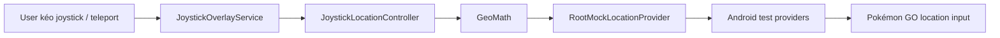
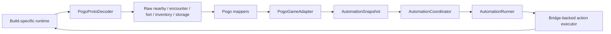

# PoGo Root Automation — Architecture Summary

> Tài liệu được cập nhật theo structured-only runtime, 2026-09-08.

## 1. Project đang làm gì?

Đây là Android controller cho Pokémon GO trên thiết bị/emulator đã root. State
game đi qua runtime bridge, còn quyết định automation nằm trong core và action
được gửi lại qua companion runtime. Khi native binding chưa sẵn sàng, pipeline
chỉ đọc và fail closed.

Các khả năng chính:

- Foreground service và HTTP control plane trên `127.0.0.1:8765`.
- Structured auto-encounter, auto-catch, auto-spin, berry, discard và transfer
  policy qua `AutomationRunner`.
- Floating joystick độc lập cho mock location.
- Magisk/Zygisk process lifecycle, runtime probe và persistent bridge.
- Stable domain model, planner và version-specific game adapters.

Project không triển khai server bot trực tiếp, Play Integrity bypass, root
hiding hay anti-detection.

## 2. Structured runtime flow

```text
Host scripts / operator
  -> ADB forward -> local HTTP API
  -> HeadlessAutomationService
  -> HeadlessAutomationEngine
  -> RuntimeBridgeClient / RuntimeSessionManager
  -> BridgePogoRuntimeSource / PogoGameAdapter
  -> AutomationCoordinator / AutomationRunner
  -> companion command channel -> Pokémon GO runtime
```

Mỗi observation được gắn với runtime session và sequence. Runner chỉ submit tối
đa một mutation cho observation, chờ outcome, rồi yêu cầu observation mới trước
khi replan. Identity, freshness, lifecycle, capability và allowlist đều được
kiểm tra ở boundary.

## 3. Android app runtime

- `MainActivity` khởi động service và hiển thị trạng thái cấu hình.
- `AutomationBootReceiver` khởi động lại service sau boot.
- `HeadlessAutomationService` tạo repository, bridge client, structured
  controller, engine và loopback API.
- `JoystickOverlayService` là service độc lập cho location control.

Config lưu trong SharedPreferences namespace `headless_automation`. Các policy
chính là `autoEncounter`, `autoCatch`, `autoCloseCatchPreview`, `autoSpin`, berry, discard/transfer và
chu kỳ polling. Preference cũ `encounter_sweep` được migrate một lần sang
`auto_encounter`; preference lựa chọn runtime cũ và các delay thao tác cũ bị
loại bỏ, không thể kích hoạt behavior đã xóa.

## 4. Engine và status contract

`HeadlessAutomationEngine` chỉ gọi `StructuredAutomationController`. Runtime
chưa ready, mất binding, thiếu capability hoặc chưa được allowlist thì không có
mutation fallback; status báo lỗi/read-only.

Status/API dùng các field runtime canonical:

- `runtimeSessionId`
- `runtimeStrongIdentityVerified`
- `runtimeLifecycle`
- `observationSeq`
- `runtimeSuspended`
- `lastAction`
- `lastError`

Không có state hiển thị, kích thước ảnh, frame counter hay sweep counter trong
engine/API.

## 5. Local control API

Server chỉ bind `127.0.0.1`; host helper tạo ADB port forward.

| Method | Endpoint | Tác dụng |
|---|---|---|
| `GET` | `/health`, `/v1/health` | Health check |
| `GET` | `/v1/status` | Structured runtime và policy status |
| `POST` | `/v1/start?...` | Bật automation và áp dụng query config |
| `POST` | `/v1/stop` | Tắt automation, giữ service/API sống |
| `POST` | `/v1/config?...` | Cập nhật config |

Không có direct manual catch/spin route. Manual action trong tương lai phải
nhận structured identity (`encounterId`/`fortId`) và đi qua `AutomationRunner`.

## 6. Built-in joystick và location control



Joystick là location control độc lập với structured automation. It uses root
app-op, GPS/network test providers, scheduled updates, speed presets và
teleport; source không chứa mock-location hiding hoặc anti-detection logic.

## 7. Zygisk/runtime bridge

Zygisk nhận diện process mục tiêu, companion ghi lifecycle/status và broker giữ
channel hai chiều. Controller dùng `RuntimeBridgeClient` để nhận:

- `RuntimeReady`
- `ObservationEvent`
- `AutomationCommandResult`
- `BindingLost`
- `RuntimeError`

Probe hiện chủ yếu read-only. Mutation yêu cầu đồng thời runtime readiness,
`strongIdentityVerified`, fingerprint exact trong allowlist và capability tương
ứng. `RuntimeStatusRepository` vẫn dùng `RootShell` để đọc diagnostics/build
identity; `RuntimeBridgeClient` cũng dùng `RootShell` để đăng ký controller UID.

## 8. Structured game-state architecture



Core định nghĩa lifecycle, nearby/encounter/fort/inventory/storage snapshots và
actions `MoveTo`, `OpenEncounter`, `Catch`, `Spin`, `UseBerry`, discard,
transfer và alert. `autoEncounter` tạo `OpenEncounter` từ nearby structured state;
`autoCatch` tạo `Catch` trong encounter; berry là action riêng trước catch.
Khi `autoCloseCatchPreview` bật, `Catch` chỉ mang close-preview intent; runtime
phải xác nhận `CAUGHT` và có capability `CATCH_AND_CLOSE_PREVIEW` trước khi
đóng preview. Probe hiện tại không có capability này nên không có fallback UI.

## 9. Module map

| Khu vực | File chính |
|---|---|
| Android entry/service | `app/src/main/java/dev/pogoroot/automation/MainActivity.kt`, `headless/HeadlessAutomationService.kt` |
| Structured loop | `app/src/main/java/dev/pogoroot/automation/headless/HeadlessAutomationEngine.kt` |
| Config/API | `headless/AutomationConfig.kt`, `headless/AutomationControlServer.kt` |
| Joystick/location | `location/*`, `overlay/*` |
| Root bridge/status | `root/RootShell.kt`, `root/RuntimeBridgeClient.kt`, `root/RuntimeStatusRepository.kt` |
| Zygisk native | `zygisk/jni/main.cpp` |
| Core model/planner | `core/src/main/kotlin/dev/pogoroot/automation/core/*` |
| Adapter contracts | `game-adapter/api/...` |
| POGO decoder/mappers | `game-adapter/pogo/...` |
| Bridge contracts | `bridge/protocol/...` |
| Host/device scripts | `scripts/*.sh` |

## 10. Verification

- JVM tests cover core planners, bridge sequencing, adapter mapping and action
  safety.
- Android compile verifies the structured-only app boundary.
- Native tests verify the runtime command protocol.
- `bash scripts/structured-only-source-guard.sh` rejects deleted visual/input
  symbols, direct manual routes and accidental removal of `RootShell`.
- Device smoke should verify runtime attach/readiness and safe rejection while
  observations/capabilities are unavailable.

## 11. Known gaps

1. Implement validated live observation hooks in the runtime.
2. Pin production adapter selection to verified build identity.
3. Implement version-scoped client-owned invokers and outcome hooks.
4. Run structured read-only device smoke before enabling mutation allowlists.
