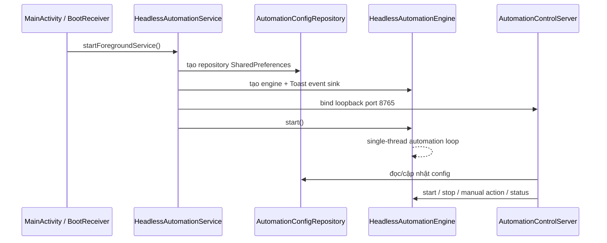
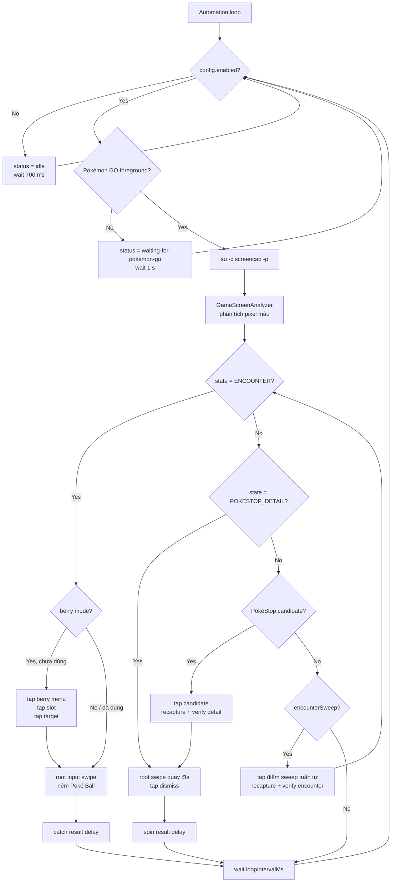
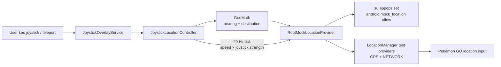
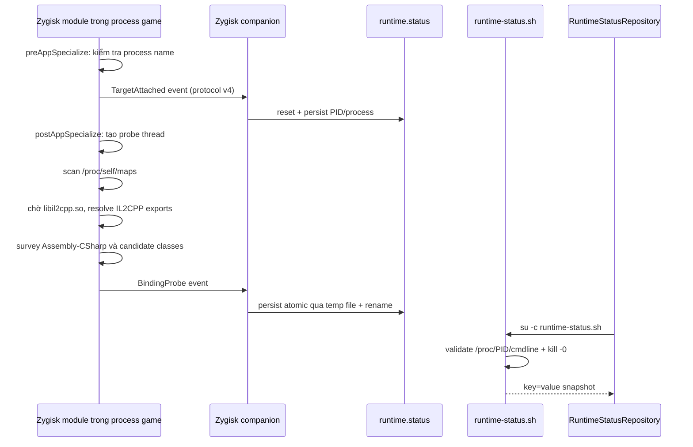
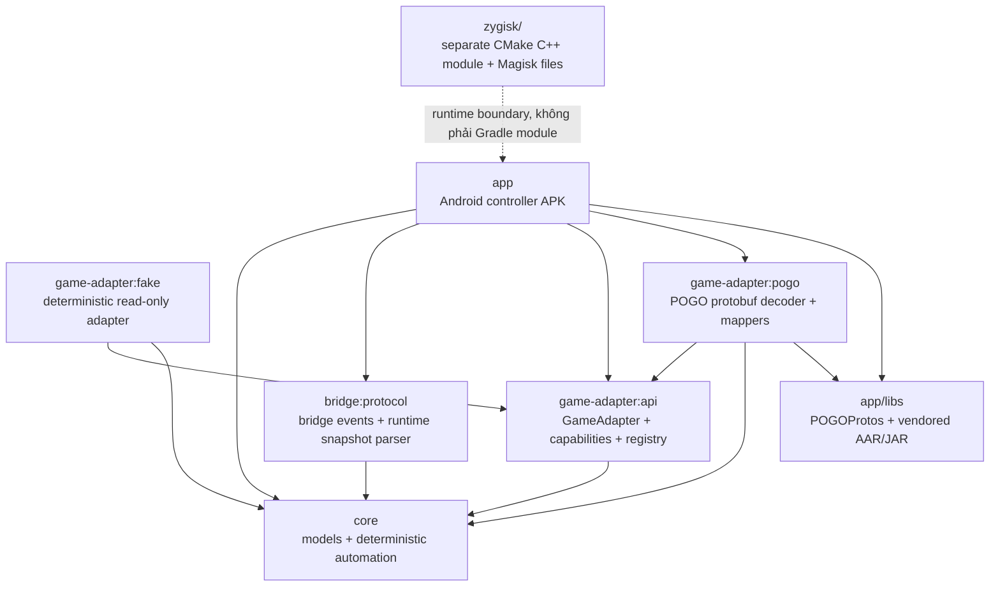

# PoGo Root Automation — Architecture Summary

> Tài liệu này được tổng hợp trực tiếp từ source trong repository. Reviewed: 2026-09-07.

> Cập nhật: structured runtime path đã được nối vào foreground service qua persistent
> Unix-domain-socket bridge nhưng là chế độ opt-in. Mặc định service giữ screen
> automation hiện có; native side hiện vẫn chỉ probe/forward và công bố zero
> capabilities, nên mutation structured giữ nguyên trạng thái read-only cho tới khi
> có fingerprint và binding client-owned đã verify.

## 1. Project đang làm gì?

Đây là một Android controller app dành cho Pokémon GO chạy trên thiết bị/emulator đã root, mục tiêu là tự động hóa các thao tác trong game nhưng vẫn tách phần quyết định khỏi phần runtime phụ thuộc từng phiên bản game.

Các khả năng chính hiện có:

- Chạy controller dưới dạng Android foreground service.
- Điều khiển từ host qua HTTP loopback `127.0.0.1:8765`, thường đi qua `adb forward`.
- Structured auto-catch/auto-spin pipeline qua runtime bridge (opt-in); screen driver vẫn là đường chạy mặc định của headless service.
- Floating joystick nội bộ, phát GPS/network test location qua Android `LocationManager`.
- Magisk/Zygisk module nhận diện process Pokémon GO, kiểm tra native runtime/IL2CPP và ghi runtime status.
- Bộ domain model, planner và game-adapter contract cho hướng structured game-state automation.

Project không triển khai server bot trực tiếp, Play Integrity bypass, root hiding hay anti-detection.

## 2. Hai luồng kiến trúc hiện tại

Source hiện tại có hai luồng tồn tại song song:

| Luồng | Trạng thái | Cách hoạt động |
|---|---|---|
| Structured runtime automation | Chế độ opt-in của headless service | Runtime observation → protobuf/mapper → `GameAdapter` → core planner → serialized action runner |
| Headless screen automation | Đường chạy mặc định | Chụp màn hình game, phân loại màn hình, gửi root input |

`HeadlessAutomationService` tạo `StructuredAutomationController`, giữ session/identity và đưa observation vào `AutomationRunner`. Runner chỉ gửi tối đa một mutation cho mỗi snapshot; build allowlist, capability, lifecycle, freshness và outcome đều được kiểm tra trước khi replan.

## 3. System context

```mermaid
flowchart LR
    Host["Host scripts / operator"]
    ADB["ADB<br/>adb forward tcp:8765"]

    subgraph Device["Rooted Android / BlueStacks"]
        App["Controller APK"]
        API["Local HTTP API<br/>127.0.0.1:8765"]
        Service["HeadlessAutomationService<br/>foreground service"]
        Engine["HeadlessAutomationEngine"]
        Overlay["JoystickOverlayService"]
        Location["RootMockLocationProvider<br/>GPS + Network test providers"]
        Root["su / root shell<br/>input + screencap + appops"]
        StatusRepo["RuntimeStatusRepository<br/>(optional/status path)"]
        StatusScript["runtime-status.sh"]
        StatusFile["/data/adb/pogo_root_automation/runtime.status"]
        Pogo["Official Pokémon GO"]
        Zygisk["Zygisk native module"]
        Companion["Zygisk companion<br/>atomic status writer"]
    end

    Host --> ADB --> API
    App --> Service
    API --> Service
    Service --> Engine
    Engine --> Root
    Root -->|"screencap / input"| Pogo

    App --> Overlay
    Overlay --> Location -->|"Android mock location"| Pogo
    Location --> Root

    Pogo -->|"process specialization"| Zygisk
    Zygisk -->|"binary RuntimeEvent"| Companion
    Companion --> StatusFile
    StatusRepo --> StatusScript --> StatusFile
    StatusScript -->|"/proc PID + package/version + maps"| StatusRepo
    StatusRepo -.->|"chưa được nối vào Engine/AdapterRegistry"| Service
```

## 4. Android app runtime

### Entry points

- `MainActivity` tạo UI đơn giản, đọc config và gọi `HeadlessAutomationService.start()` ngay trong `onCreate`.
- `AutomationBootReceiver` lắng nghe `BOOT_COMPLETED` và khởi động lại headless service.
- `HeadlessAutomationService` là foreground service, khởi tạo config repository, engine và local HTTP server.
- `JoystickOverlayService` là foreground service độc lập cho floating joystick và automation settings.

Manifest cũng khai báo các quyền location, overlay, foreground service, notification và boot completed.

### Service lifecycle

Config được lưu trong SharedPreferences namespace `headless_automation`. Các tham số gồm bật/tắt automation, catch/spin, encounter sweep, berry, discard/transfer policy và delay/cooldown. Config có giới hạn giá trị khi đọc và ghi.

## 5. Luồng headless automation đang chạy thật

### Nhận diện màn hình

`GameScreenAnalyzer` không đọc object/game state từ Pokémon GO. Nó lấy một số pixel trong các vùng cố định:

- Encounter: bright-neutral và màu Poké Ball, ngưỡng confidence `0.62`.
- PokéStop detail: pixel xanh/cyan, ngưỡng `0.58`.
- Overworld: tìm cụm pixel xanh bằng grid, ưu tiên candidate gần vùng trung tâm.
- Không khớp: `UNKNOWN`.

Các hành động sử dụng tọa độ normalized theo kích thước screenshot nên không hard-code một độ phân giải duy nhất, nhưng heuristic vẫn cần calibration theo device/emulator.

`RootUiDriver` kiểm tra foreground bằng `dumpsys activity activities`, rồi chạy `input tap`/`input swipe` qua `su`. Vì vậy Pokémon GO phải ở foreground; controller có thể chạy background nhưng chưa thể điều khiển game khi game không active.

`autoDiscard` và `autoTransfer` đã xuất hiện trong config/settings và có planner trong `core`, nhưng `HeadlessAutomationEngine` hiện chưa thực thi hai loại action này.

## 6. Local control API

Server chỉ bind `127.0.0.1`, không bind LAN và không có authentication riêng. Host helper tạo ADB port forward.

| Method | Endpoint | Tác dụng |
|---|---|---|
| `GET` | `/health`, `/v1/health` | Health check |
| `GET` | `/v1/status` | Worker state, screen state, counters, config |
| `POST` | `/v1/start?...` | Bật automation và áp dụng query config |
| `POST` | `/v1/stop` | Tắt automation, giữ service/API sống |
| `POST` | `/v1/config?...` | Cập nhật config |
| `POST` | `/v1/actions/catch` | Manual catch bằng screen driver |
| `POST` | `/v1/actions/spin` | Manual spin bằng screen driver |

Các script host chính:

- `scripts/headless-control.sh`: bootstrap service, forward port, gọi API và launch game.
- `scripts/device-smoke-test.sh`: test lifecycle connect → disconnect → reconnect của runtime module.
- `scripts/bluestacks-smoke-test.sh`: xác định BlueStacks, ABI và module binary.
- `scripts/binding-probe-test.sh`: chờ native binding probe hoàn tất.
- `scripts/collect-binding-diagnostics.sh`: thu thập package, ABI, process, native maps và runtime status.

## 7. Built-in joystick và location control

Chi tiết:

- Joystick dùng scheduled executor, tick mỗi `50 ms`.
- Bearing được đổi từ góc joystick bằng `GeoMath.joystickAngleToBearing`.
- Khoảng cách mỗi tick được tính từ speed km/h và elapsed time rồi tính điểm đích địa lý.
- Teleport publish ngay một điểm mới với speed bằng 0.
- Vị trí cuối được lưu trong SharedPreferences của overlay service.
- Overlay có speed presets, coordinate display, teleport dialog và automation settings.

Đây là mock location có root app-op; source không chứa mock-location hiding hoặc anti-detection.

## 8. Zygisk/runtime bridge

### Runtime lifecycle và probe

Zygisk target hai process:

- `com.nianticlabs.pokemongo`
- `com.nianticlabs.pokemongo.ares`

Probe hiện là read-only. Nó kiểm tra `libil2cpp.so`, `libunity.so`, translation layer (`houdini`/`ndk_translation`), resolve nhóm IL2CPP C API, enumerate assemblies/classes và ghi diagnostics. Nó chưa hook game method, chưa lấy live game state và chưa gọi action trong game.

`runtime-status.sh` dùng PID và `/proc/<pid>/cmdline` để tránh status file stale bị báo connected. Script cũng derive package/version hiện cài, native paths, ABI, zygote và kernel machine.

`RuntimeStatusRepository` vẫn giữ vai trò diagnostics/build identity. Structured control/data path dùng `RuntimeBridgeClient`, `RuntimeSessionManager`, `BridgePogoRuntimeSource` và `BridgePayloadCodec`; khi native binding chưa sẵn sàng, runtime chỉ phát readiness read-only và reject command.

## 9. Structured game-state architecture

Đây là hướng kiến trúc dài hạn được chuẩn bị trong `core`, `bridge:protocol` và `game-adapter:*`:

```mermaid
flowchart LR
    Runtime["Build-specific PogoRuntimeSource<br/>(chưa có implementation live)"]
    Proto["PogoProtoDecoder<br/>EncounterOutProto / GetMapObjectsOutProto"]
    Raw["Raw observations<br/>nearby / encounter / fort / inventory / storage"]
    Mapper["Pogo*Mapper<br/>validation + stable domain mapping"]
    Adapter["PogoGameAdapter<br/>GameAdapter port"]
    Snapshot["AutomationSnapshot<br/>lifecycle + nearby + encounter + forts + inventory + storage"]
    Core["AutomationCoordinator"]
    Planner["CatchPlanner<br/>InventoryPlanner<br/>TransferPlanner"]
    Actions["AutomationAction list"]
    Executor["PogoActionExecutor<br/>(chưa có live implementation)"]
    Game["Pokémon GO runtime"]

    Runtime --> Proto --> Raw --> Mapper --> Adapter --> Snapshot --> Core
    Core --> Planner --> Actions --> Executor --> Game
    Game -.->|"runtime observation / RPC payload"| Runtime
```

### Domain model

`core` định nghĩa các model ổn định, không biết về Android, Zygisk hay offset:

- Lifecycle: `DISCONNECTED`, `STARTING`, `LOADING`, `OVERWORLD`, `ENCOUNTER`, `ERROR`.
- `NearbySnapshot`/`NearbySpawn`: spawn id, species, vị trí, first-seen, expiry và confidence.
- `EncounterSnapshot`: IV, shiny, CP, vị trí; tự suy ra Hundo/Shundo.
- `FortSnapshot`, `InventorySnapshot`, `PokemonStorageSnapshot`.
- `AutomationAction`: move, open encounter, catch, spin, discard, transfer, alert.

### Core logic

- `NearbySnapshotReducer`: deduplicate theo spawn id, loại entry đã expired và tạo added/updated/removed diff.
- `CountdownService`: tính remaining time; nếu expiry không biết thì giữ `null`, không tự bịa exact timestamp.
- `CatchPlanner`: ưu tiên Shundo, shiny, Hundo, IV threshold, rồi catch-all.
- `InventoryPlanner`: tạo `DiscardItem` cho stack vượt max count.
- `TransferPlanner`: không transfer favorite, shiny, Hundo, special background, legendary/mythical theo policy; các Pokémon dưới ngưỡng IV mới được chọn.
- `AutomationCoordinator`: chỉ plan encounter khi lifecycle là `ENCOUNTER`; ở `OVERWORLD` có thể plan discard, transfer, spin và mở encounter gần nhất.

### Adapter boundary

`GameAdapter` tách app/core khỏi game build cụ thể và khai báo capability:

- Read lifecycle/nearby/forts/inventory/storage/encounter.
- Execute catch/spin/discard/transfer.

`GameAdapterRegistry` resolve factory theo `GameBuild` fingerprint. Không match hoặc match nhiều factory đều fail closed. `FakeGameAdapter` chỉ cung cấp lifecycle + nearby deterministic để test/dev.

`PogoGameAdapter` hiện đã có mapper/contract cho runtime source, nhưng repository chưa có implementation cụ thể của `PogoRuntimeSource`, factory production hoặc `PogoActionExecutor` live.

## 10. Module/dependency architecture

Gradle modules được include trong `settings.gradle.kts`:

- `:app`
- `:core`
- `:bridge:protocol`
- `:game-adapter:api`
- `:game-adapter:fake`
- `:game-adapter:pogo`

`zygisk` được build riêng bằng CMake/NDK và đóng gói thành Magisk ZIP. CI build cả `arm64-v8a` và `x86_64` để hỗ trợ thiết bị ARM cũng như BlueStacks.

## 11. Build, test và deployment

- Android app: compile/target SDK 36, min SDK 28.
- JVM modules: Kotlin JVM toolchain 17.
- Native: C++17, Android NDK/CMake; compile flags `-Wall -Wextra -Werror`.
- CI chạy shell syntax checks, kiểm tra hash các vendored libraries, unit tests cho core/adapters/bridge, build APK, build native hai ABI và package Magisk ZIP.
- POGOProtos được vendored tại `app/libs/POGOProtos-2.60.8.jar`; `PogoProtoDecoder` parse `EncounterOutProto` và `GetMapObjectsOutProto`.

Unit tests hiện bao phủ:

- Geo math và countdown.
- Nearby reducer.
- Catch/inventory/transfer planner và coordinator.
- Game adapter registry, fake adapter.
- POGO mapper/decoder/adapter.
- Runtime status parser.

## 12. Khoảng trống và thứ tự nối tiếp hợp lý

Các phần còn thiếu để biến structured pipeline thành runtime automation đầy đủ:

1. Implement observation hooks trong runtime để phát lifecycle/nearby/encounter payload đã validate.
2. Nối verified native/metadata/APK identity vào `GameBuild` và pin adapter allowlist trên thiết bị.
3. Implement version-scoped client-owned invoker cho từng capability, bắt đầu từ `Spin` rồi `Catch`.
4. Hoàn thiện outcome hooks (`accepted`/`started`/`completed`) và device read-only/contract validation.
5. Giữ screen driver như fallback/calibration tool, không coi heuristic pixel detection là nguồn game state chính.

## 13. Source map nhanh

| Khu vực | File chính |
|---|---|
| Android entry/service | `app/src/main/java/dev/pogoroot/automation/MainActivity.kt`, `headless/HeadlessAutomationService.kt` |
| Headless loop | `app/src/main/java/dev/pogoroot/automation/headless/HeadlessAutomationEngine.kt` |
| Screen capture/analyzer/input | `app/src/main/java/dev/pogoroot/automation/headless/ScreenAutomation.kt` |
| Config/API | `headless/AutomationConfig.kt`, `headless/AutomationControlServer.kt` |
| Joystick/location | `location/*`, `overlay/*` |
| Root shell/status | `root/*`, `zygisk/module/bin/runtime-status.sh` |
| Zygisk native | `zygisk/jni/main.cpp` |
| Core model/planner | `core/src/main/kotlin/dev/pogoroot/automation/core/*` |
| Adapter contracts | `game-adapter/api/...` |
| POGO decoder/mappers | `game-adapter/pogo/...` |
| Bridge contracts | `bridge/protocol/...` |
| Host/device scripts | `scripts/*.sh` |
