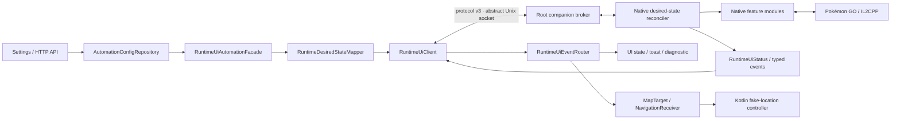

# PoGo Root Automation — Dataflow tổng thể

> Luồng source hiện tại sau refactor Kotlin UI-only, đối chiếu 2026-09-22.
> Native là owner của PoGo runtime/gameplay; Kotlin là controller UI,
> persistence và fake-location.

## 1. Bốn tầng và ranh giới

```text
APP (Kotlin)
  UI · SharedPreferences · HTTP facade · RuntimeUiClient · fake location
        │ RuntimeDesiredState / RuntimeUiStatus / typed events
BRIDGE (Kotlin ↔ C++)
  versioned frames · session · identity · sequence · freshness · peer auth
        │ authenticated Unix-socket broker
NATIVE (C++)
  readiness · desired reconciliation · capability/build guards · modules
        │ verified main-thread bridge / IL2CPP bindings
POKÉMON GO (Unity / IL2CPP)
```

`app` runtime chỉ phụ thuộc `core` và `bridge:protocol` (ngoài joystick AAR).
`game-adapter/*` vẫn được build/test độc lập nhưng không nằm trong APK
dependency graph. Không có screenshot, `input tap`/`input swipe`, file queue,
shared-preference polling hoặc direct cross-process JNI làm gameplay transport.

## 2. Luồng live



Kotlin gửi full desired snapshot khi revision đổi hoặc session mới. Native lưu
intent RAM-only, tự readiness và apply nguyên snapshot theo revision. Native
phát status với desired/applied/ready tách biệt; nhận receipt không chứng minh
catch/spin/discard/transfer đã hoàn tất.

## 3. Native ownership

Injected runtime giữ binding/pointer, đọc game state và quyết định feature.
Companion/broker giữ peer authentication, session forwarding, status replay
cache một bản mới nhất và diagnostics. Native module chịu trách nhiệm action,
pending state, outcome/cooldown và fail-closed guards.

Các công việc cần Unity main thread vẫn đi qua bridge hiện có. Build fingerprint,
package/process/ABI, capability, lifecycle, object lifetime, expiry và freshness
phải hợp lệ trước mutation. Module có trong source không đồng nghĩa capability
được advertise trên mọi build.

## 4. Bridge / IPC contract

Controller dùng abstract Unix socket `pogo_root_automation_runtime`. Broker xác
thực `SO_PEERCRED` với `controller.uids`, rồi chuyển frame đến companion/runtime.
Frame controller là big-endian, protocol version 3, header 16 byte:

```text
[payloadLength:u32][version:u16][messageType:u16][messageSeq:u64][payload]
```

Kotlin codec và C++ wire definition phải đổi cùng nhau. Payload có schema và
giới hạn riêng; message bị malformed, unsupported, sai session/identity/seq,
quá hạn hoặc quá lớn đều bị từ chối. `RuntimeMainThreadBridge.java` ở process
game chỉ là JNI scheduling helper, không phải controller IPC.

### 4.1 App → native

- `RuntimeDesiredStateRequest`: session/request identity, expiry và full desired
  config revision; không chứa target Pokémon, fort hay mutation queue.
- Explicit diagnostic request và các command legacy còn wire-compatible nhưng
  không được service dùng làm gameplay orchestration.

### 4.2 Native → app

- `RUNTIME_READY`: transport/runtime identity và capabilities.
- `RUNTIME_UI_STATUS`: lifecycle, module state, capabilities, desired/applied
  revision và error; broker chỉ cache/replay status mới nhất.
- Automation event, navigation, map target, throw diagnostic, result, binding
  lost và runtime error theo DTO/codec versioned.
- Không phát raw nearby/encounter/fort/inventory để Kotlin tự plan.

## 5. Session, reconnect và persistence

Native/companion là session authority. Kotlin không mint session, không khôi
phục pointer/readiness/pending action từ SharedPreferences. Session mới làm
router reset sequence/navigation và facade gửi desired snapshot mới nhất.

`headless_automation` là durable source of truth của user config. Native
desired/applied mirrors, expiry, cooldown, pending action và game state chỉ ở
RAM. Root `runtime.status` và `controller.uids` là metadata diagnostics/auth,
không phải config queue.

Khi controller reconnect, broker không replay gameplay command; chỉ đưa status
UI mới nhất cho controller mới. Native mutation không được cấp quyền chỉ vì
socket connect, START/ACK, desired receipt hoặc local location arrival.

## 6. Kotlin UI/location path

`RuntimeUiEventRouter` kiểm tra session, pid/process/package/fingerprint,
sequence, timestamp, payload size và capability trước khi cập nhật
`RuntimeUiStateStore`. Router bỏ qua raw game-state event và không import
`game-adapter:pogo`/`GameCapability`.

Location exception:

- Người dùng chọn tọa độ/favorite: Kotlin validate, plan bước, arrival/cancel và
  ghi Android mock location.
- Native chọn fort/map target: Kotlin chỉ chấp nhận event có capability,
  freshness và lease; `NativeNavigationReceiver` giới hạn lease 5 giây.
- Map target có TTL 30 giây; local arrival chỉ dừng movement, không dispatch
  gameplay.

## 7. API và compatibility

`AutomationControlServer` giữ endpoint/query tương thích cho scripts:

| Endpoint | Hành vi hiện tại |
|---|---|
| `GET /v1/status` | Desired config + native status, phân biệt ready/applied |
| `POST /v1/start` | Ghi desired enabled/config qua facade |
| `POST /v1/stop` | Ghi desired disabled; không gửi gameplay loop |
| `POST /v1/config` | Validate/lưu config và tăng revision |
| `POST /v1/runtime/diagnostic` | Gửi explicit diagnostic request |

`RuntimeLifecycleCoordinator`, ba config dispatcher và `RuntimeControlBridge`
vẫn có thể tồn tại cho `RuntimeLifecycleCoordinatorTest`, nhưng production
service/API không tạo chúng. `game-adapter/*`, `RuntimeSessionManager` và action
contract còn consumer cũng được giữ có lý do; không tuyên bố đã xóa toàn bộ
legacy source.

## 8. Verification boundary

Full Gradle, focused Kotlin tests, sáu native host checks và multi-ABI package
đã đạt; test source không đổi. Device matrix T-022 chưa chạy vì máy hiện tại
không có BlueStacks Air 1; xem
[`kotlin-ui-only-boundary/verification.md`](issues/2026-09-22/kotlin-ui-only-boundary/verification.md).

Không dùng static review hoặc host checks để tuyên bố live binding/action/device
pass. Các capability chưa có exact build/device evidence tiếp tục bị native
gate và fail closed.
