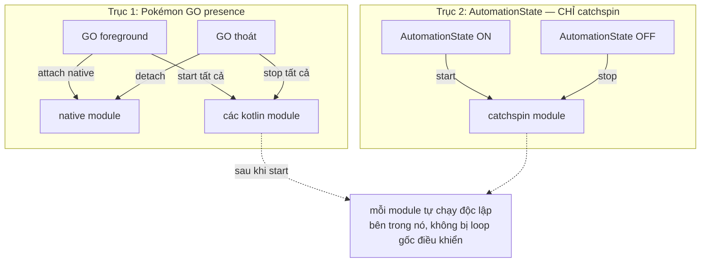
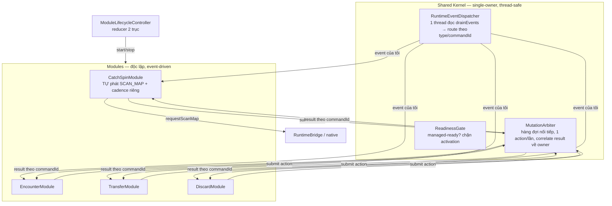

# Automation Flow — Target Architecture (mô tả theo ý user)

> File nháp brainstorm lại flow. User mô tả từng phần, Claude ghi lại + sau đó làm từng phần.
> **Nguyên tắc cốt lõi:** sau khi được `start`, mỗi module **tự chạy độc lập bên trong nó**,
> KHÔNG còn bị central engine/loop gốc điều khiển theo từng cycle.

---

## Phần 1 — Lifecycle (start/stop module)

Có **2 trục điều khiển độc lập**:

### Trục 1 — Sự hiện diện của Pokémon GO
Điều khiển native + **tất cả** kotlin module.

| Sự kiện | Hành động |
|---------|-----------|
| Pokémon GO **foreground** | `attach native module` → `start` **tất cả** kotlin module |
| Pokémon GO **thoát / mất foreground** | `stop` **tất cả** kotlin module → `stop / detach native module` |

### Trục 2 — AutomationState (ON/OFF)
Chỉ điều khiển **riêng catchspin module**. Các module khác KHÔNG quan tâm.

| Sự kiện | Hành động |
|---------|-----------|
| AutomationState → **ON** | `start` catchspin module |
| AutomationState → **OFF** | `stop` catchspin module |

### Bảng tổng hợp trạng thái catchspin
> **Chốt:** catchspin cần CẢ HAI điều kiện (GO-present **và** AutomationState ON).
> GO-present là điều kiện cần chung của HeadlessService; AutomationState là gate riêng chồng thêm.
> Khi cờ state = ON thì catchspin **auto-start** (miễn GO đang present).

| Pokémon GO | AutomationState | catchspin module | các module khác |
|-----------|-----------------|------------------|-----------------|
| present | ON  | **running** | running |
| present | OFF | stopped | running |
| absent  | —   | stopped | stopped (native detached) |

### Sơ đồ



**Đã chốt phần 1:**
- Catchspin cần **cả** GO-present (điều kiện cần chung của HeadlessService) **và** AutomationState ON. Cờ state = ON → catchspin auto-start.
- "start module" = **event-driven**. Bên trong mỗi module sẽ tự tạo thread riêng (làm sau), không do loop gốc điều khiển.

---

## Phần 2 — Rủi ro của kiến trúc "module độc lập hoàn toàn"

Game Pokémon GO là **một bề mặt tuần tự**; native event stream là **một kênh duy nhất**.
Vì vậy "module độc lập" vẫn không thể tách 3 thứ dùng chung.

### 🔴 Nghiêm trọng
1. **Game tuần tự vs module song song.** Không thể vừa ném bóng vừa spin gym. Hiện `AutomationRunner`
   chỉ giữ **một** `activeExecution` — đó là cơ chế nối tiếp. Tách N thread → N module cùng submit
   → xung đột hành động thật. ⇒ cần **mutation arbiter / lock toàn cục**.
2. **Event stream một nguồn.** Native đẩy observation + result qua một kênh (`drainEvents`). Nhiều
   module tự drain → giành/mất/race event. ⇒ cần **một demultiplexer** đọc rồi fan-out.
3. **Correlation result.** Result về theo `commandId`. Nhiều module submit → cần map
   `commandId → module owner`. Mô hình "một active execution" hiện tại vỡ.

### 🟠 Cần xử lý
4. **Gate managed-ready.** START là probe-only; capabilities/`strongIdentityVerified` chỉ về **sau**
   DIAGNOSTIC. Module tự start khi GO-present có thể submit **trước khi verified**. ⇒ activation phải
   chờ readiness handshake.
5. **Shutdown join trước detach.** GO thoát → phải cancel + **join** thread từng module **trước** khi
   detach native, nếu không thread module chạm bridge đã detach → crash. 2 trục fire lệch nhịp ⇒ cần
   precedence: **GO-absent luôn override**.

> ~~G6 Scan trùng lặp~~ — **KHÔNG áp dụng.** `SCAN_MAP` là request **riêng của CatchSpinModule**,
> không phải snapshot dùng chung. Scan cadence nằm trong chính catchspin. Module khác không scan.

### 🟡 Chi phí phụ
7. Trùng lặp hạ tầng (thread + pacing + config-watch mỗi module) + khó test (N thread nondeterministic).
8. Config propagation: loop gốc đọc config mỗi cycle; module độc lập cần cơ chế push/observe config.

---

## Phần 3 — Đề xuất kiến trúc

**Nguyên tắc:** tách **"quyết định" (độc lập per-module)** khỏi **"hạ tầng dùng chung" (single-owner)**.
3 thứ shared gom thành một *kernel* mỏng; module cắm vào qua interface hẹp. Module độc lập về
**planning**, nối tiếp về **thực thi**.



### 3.1 Kernel — CHỈ 2 thứ dùng chung (rút ra từ `StructuredAutomationController`)
> Scan KHÔNG nằm ở kernel — nó là việc riêng của CatchSpinModule (xem 3.2b).
- **`RuntimeEventDispatcher`**: MỘT thread đọc `source.drainEvents()`, route event về đúng module
  (theo `ObservationType` owner + `commandId`). Module **subscribe**, không tự drain. → fix G2.
- **`MutationArbiter`**: **shared/exclusive lock** (không phải hàng đợi nối tiếp cứng) — action
  EXCLUSIVE chiếm lock chặn mọi người; CONCURRENT chạy song song trừ khi có exclusive đang giữ. Gắn tag
  owner để trả result đúng chỗ; giữ lock đúng action-window + timeout backstop. Chi tiết ở 3.2c. → fix G1, G3.
- **`ReadinessGate`**: giữ nguyên logic probe-only START + DIAGNOSTIC; chỉ activate khi `managedReady`. → fix G4.

### 3.2b Phân loại module — 2 loại (contract để mở rộng)

> **Đây là điểm cốt lõi.** Module chỉ có 2 loại. Thêm module mới sau này = chọn loại A hoặc B
> rồi implement phần planning riêng — **không đẻ thêm khái niệm mới**. Bảng "ví dụ hiện tại"
> ở dưới chỉ là các instance đang có, không phải danh sách cứng.

Mọi module đều: submit action qua **MutationArbiter**, nhận result qua **Dispatcher**.
Khác nhau ở chỗ **cái gì trigger việc plan**:

#### Loại A — Reactive (native-driven)
Dựa vào lifecycle/event native **bắn về** rồi mới trigger action. Không tự phát request, không cần
timer riêng — Dispatcher gọi callback là chạy.
```kotlin
interface ReactiveModule : AutomationModule {
    fun onEvent(event: BridgeEvent)   // Dispatcher route event của tôi về đây → plan → submit
}
```

#### Loại B — Self-driven (periodic)
Tự phát request định kỳ (giống `CatchSpinModule` phát `SCAN_MAP`), nhận observation tương ứng qua
Dispatcher, rồi plan. Có **timer/thread riêng** cho cadence.
```kotlin
interface PeriodicModule : AutomationModule {
    val intervalMs: Long
    fun onTick()                      // tới kỳ → tự phát request (vd requestScanMap)
    fun onEvent(event: BridgeEvent)   // observation trả về → plan → submit
}
```

### 3.2c Trục 2 — Execution (EXCLUSIVE / CONCURRENT)

**Trục này VUÔNG GÓC với trục Trigger (A/B).** A/B = *cái gì kích hoạt plan*; Execution = *khi chạy
action có chặn module khác không*.

```kotlin
enum class ExecutionMode {
    EXCLUSIVE,   // đang chạy action → chặn mọi module khác (kể cả exclusive khác)
    CONCURRENT,  // chạy song song với concurrent khác; chỉ bị chặn khi có exclusive đang giữ lock
}
```

Cơ chế = **shared/exclusive lock** (kiểu readers-writers):
- Action **EXCLUSIVE** → chiếm exclusive lock → không action nào khác chạy → xong nhả.
- Action **CONCURRENT** → chạy song song với concurrent khác, nhưng **không start khi exclusive đang giữ lock**.
- Kết quả: catch-spin/encounter chặn transfer/discard; transfer + discard chạy đồng thời; hai exclusive
  (catch-spin vs encounter) cũng tự loại trừ nhau.

#### Vòng đời lock — bám đúng action-window (KHÔNG chặn lúc scan/plan)
1. Periodic tick → `SCAN_MAP` → nhận observation → plan. **(không lock — transfer/discard vẫn chạy)**
2. Plan quyết ném/quay → **acquire exclusive lock** → dispatch `TRY_CATCH` / `TRY_SPIN`.
3. Native trả các phase (`ACCEPTED`/`STARTED`/`COMPLETED`...).
4. Nhận **response hợp lý** → **release lock**.

Khớp code hiện có: `SCAN_MAP` không phải mutation nên không lock; nhả lock gắn với
`ActionExecutionPhase` trong `consumeResult`.

#### Policy nhả lock — **CHỌN (b)**
- Giữ lock tới khi có **authoritative outcome** (đồng bộ với hành vi `holdDirectCatchResult` hiện tại:
  catch `DIRECT_MAP` trả `INDETERMINATE` thì **giữ**, chưa ném tiếp).
- **Timeout backstop bắt buộc:** nếu native không trả response → `SAFE_TIMEOUT` / `runner.checkTimeout()`
  hết giờ → coi như terminal → **nhả lock**. Quy tắc nhả = **authoritative outcome HOẶC timeout**
  (không có timeout thì một `TRY_CATCH` mất response sẽ deadlock transfer/discard).

#### Chờ-drain khi exclusive muốn vào lúc concurrent đang chạy
Exclusive **chờ** concurrent hiện tại (transfer/discard ngắn) chạy xong rồi mới chiếm lock — không preempt.
Timeout vẫn là backstop.

#### Ví dụ hiện tại (2 trục độc lập)
| Module | Trigger | Execution |
|--------|---------|-----------|
| CatchSpin | **B — periodic** | **EXCLUSIVE** |
| Encounter | **B — periodic** | **EXCLUSIVE** |
| Transfer  | **A — reactive** | **CONCURRENT** |
| Discard   | **A — reactive** | **CONCURRENT** |

> Module mới ⇒ thêm một dòng, chọn Trigger (A/B) + Execution (EXCLUSIVE/CONCURRENT). Hai trục tự do
> kết hợp (có thể A+exclusive hoặc B+concurrent).

### 3.2 Module contract
```kotlin
interface AutomationModule {
    val id: RuntimeFeatureModule
    fun start(host: ModuleHost)   // subscribe scan+event; tự tạo thread riêng nếu cần
    fun stop()                    // cancel + JOIN thread của mình, unsubscribe
}
// ModuleHost = cửa hẹp vào kernel: subscribeScan(), subscribeEvents(), submit(action) -> result
```
Module tự planning (`onWorldSnapshot` → tính action) nhưng thực thi qua `host.submit()`.

### 3.3 Lifecycle = reducer 2 trục
```
desiredActive(module) = gameReady && (module != CATCH_SPIN || automationOn)
```
`ModuleLifecycleController` nghe GO-presence (`JoystickAutoStartCoordinator`/`GameForegroundDetector`)
và `AutomationState`; mỗi lần đổi thì diff desired vs current → `start()`/`stop()`. Catchspin chỉ khác
đúng một điều kiện `automationOn`, không rải code đặc biệt.

### 3.4 Engine gốc co lại
`HeadlessAutomationEngine.runLoop` + `AutomationCycle` (double-tick, scan-gating) **biến mất**.
Engine chỉ còn: sở hữu kernel threads + chạy `ModuleLifecycleController`.

### ⚠️ Cảnh báo "thread riêng mỗi module"
Nếu module chỉ **phản ứng** với snapshot/event thì **không cần** thread riêng — dispatcher gọi callback
là đủ, `MutationArbiter` đã có thread thực thi riêng. Thread-per-module chỉ nên dùng khi module có việc
chạy dài (vd. chuỗi walk/berry có nhịp riêng). ⇒ **mặc định event-driven, thread riêng là opt-in**.

### Lộ trình sửa (tăng dần, ít rủi ro)
1. Rút `RuntimeEventDispatcher` + `WorldScanSource` + `MutationArbiter` ra khỏi `StructuredAutomationController`.
2. Định nghĩa `AutomationModule` + `ModuleHost`.
3. Chuyển planning catchspin (`runner.onObservation` + core planner) vào `CatchSpinModule`.
4. Viết `ModuleLifecycleController` với reducer 2 trục; nối GO-presence + AutomationState.
5. Xoá scan/tick trong `AutomationCycle`, thu nhỏ `HeadlessAutomationEngine`.

---

## Phần 4 — Ánh xạ vào code hiện có (quan trọng cho implementation)

**Kernel KHÔNG viết từ đầu — phần lớn đã có trong `:core`:**
- **`MutationArbiter` (nối tiếp + timeout)** ≈ **`AutomationRunner`** đã có: một `active` execution tại
  một thời điểm, `checkTimeout()`/`markSafeTimeout()` (timeout backstop), xử lý `INDETERMINATE`/authoritative
  outcome (đúng policy (b)), `map-sync`, settle-gate, session identity. ⇒ Arbiter **bọc quanh** runner,
  KHÔNG thay.
- **Per-module planning** ≈ **`AutomationCoordinator` + `ModuleActionPlanner`** (Catch/Discard/Encounter/
  Transfer planners) đã có: mỗi module tự khai `plan()`, coordinator ghép theo thứ tự ưu tiên.

**Ràng buộc PHẢI giữ — catch_spin ↔ encounter KHÔNG độc lập hoàn toàn:**
- `AutomationCoordinator` dùng `PlanningContext` chia sẻ `overworldTargetSpawn` + `encounterCatchDecision`
  giữa catch_spin và encounter (hai cái **loại trừ nhau** trên cùng một target). Khi tách module,
  coupling này phải được giữ (cùng một "world lens"), không để 2 module tự chọn target đá nhau.

**Điểm MỚI thật sự phải làm (không có sẵn):**
1. **EXCLUSIVE/CONCURRENT groups.** Hiện `AutomationRunner` serialize **mọi** mutation (mọi thứ đều
   exclusive). Muốn transfer/discard chạy song song với catch/spin ⇒ cần tách execution theo nhóm
   tranh-chấp (world-UI lock vs inventory), thay vì một slot chung.
2. **Event-driven lifecycle 2 trục** (`ModuleLifecycleController`) + start/stop/join thread module.
3. **`RuntimeEventDispatcher`** fan-out kênh native về đúng module (thay `when(type)` trong controller).

> ⚠️ Điểm (1) đụng vào semantics core (state machine tinh vi: indeterminate hold, map-sync, settle).
> Cần làm cẩn thận, có thể là bước rủi ro nhất — tách riêng, verify kỹ.
