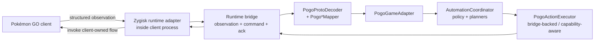
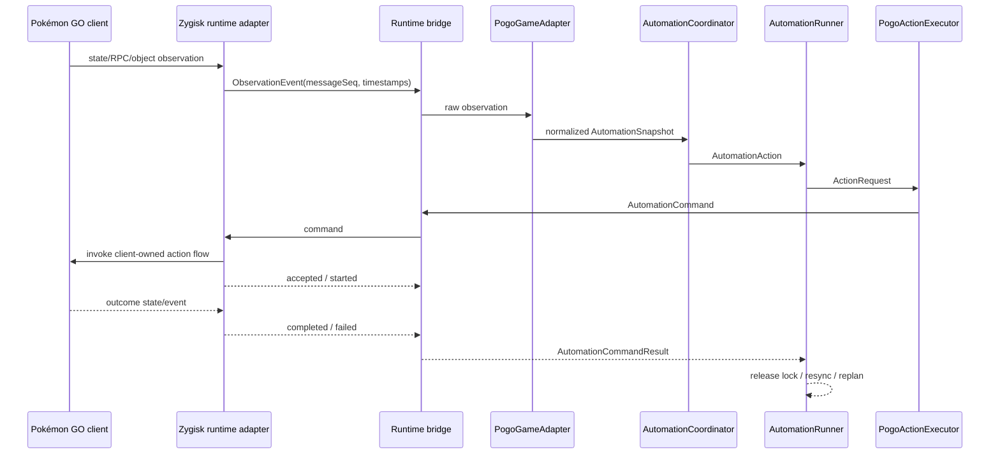
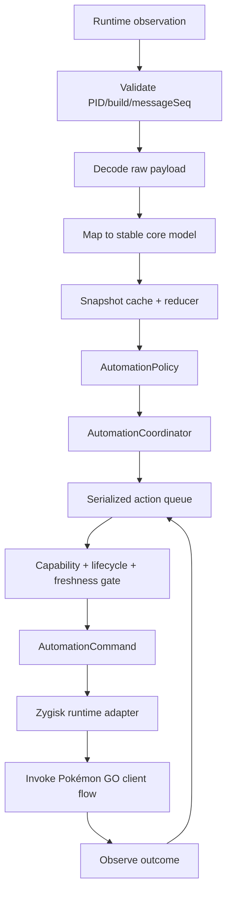

# Brainstorm: Structured state và gọi ngược vào Pokémon GO client

**Type:** architecture
**Date:** 2026-09-07

---

## Analysis

### 1. Bài toán cần giải quyết

Loại bỏ việc dùng `GameScreenAnalyzer`, pixel heuristic và `input tap/swipe` làm nguồn quyết định automation. Thay vào đó, hệ thống phải:

1. Nhận game state có cấu trúc từ Pokémon GO runtime.
2. Chuẩn hóa state thành domain model ổn định.
3. Chạy policy/planner trong `core`.
4. Gửi command ngược vào process Pokémon GO.
5. Để chính client Pokémon GO thực hiện flow nội bộ và giao tiếp backend theo session của client.

Kiến trúc mục tiêu:



### 2. Ràng buộc

#### Hard constraints

- Pokémon GO chạy Unity/IL2CPP; binding phụ thuộc package, version code, ABI, translation layer và native layout.
- `zygisk/jni/main.cpp` hiện mới làm target-process detection, native probe, IL2CPP symbol discovery và metadata survey.
- Zygisk module chưa đọc game object/RPC payload và chưa invoke gameplay method.
- `bridge:protocol` hiện có `RuntimeStatus`, `NearbyUpdated`, `RuntimeError`, chưa có command/ack/outcome contract.
- `PogoRuntimeSource` và `PogoActionExecutor` hiện chỉ là interface.
- `PogoProtoDecoder` chỉ decode payload đã có sẵn; nó không sở hữu transport hoặc runtime hook.
- `GameAdapterRegistry` có fail-closed resolution nhưng chưa được đăng ký trong production app.
- `HeadlessAutomationEngine` hiện chạy screen path trực tiếp, chưa gọi `AutomationCoordinator`/`PogoGameAdapter`.
- Backend flow phải được khởi tạo và thực thi bởi Pokémon GO client trong process của nó.
- `AutomationAction` phải tiếp tục là domain intent thuần; command lifecycle metadata thuộc execution/bridge layer.

#### Soft constraints

- Giữ `AutomationControlServer`, `AutomationConfigRepository` và host API hiện có.
- Giữ các domain contract trong `core` làm boundary độc lập Android/Zygisk.
- Giữ `AutomationAction` làm format quyết định chung giữa planner và executor.
- Cho phép thêm adapter theo từng build mà không sửa logic planner.
- Mọi mutation phải explicit opt-in và mặc định fail closed.

#### Thông tin cần thu thập trước khi bind thật

- Package/version code đang chạy.
- `binding_strategy`, ABI, kernel machine và translation layer.
- Runtime path chứa nearby/encounter state.
- Cách xác định lifecycle và action outcome trong client.
- Class/method hoặc RPC dispatch path ổn định của build mục tiêu.

### 3. Quality attributes

Ưu tiên theo thứ tự:

1. **Correctness:** state và action phải tương ứng đúng lifecycle client.
2. **Fail-closed safety:** binding mismatch, stale state, IPC disconnect hoặc outcome không rõ phải dừng mutation.
3. **Maintainability:** game-specific binding chỉ nằm ở `game-adapter:pogo`/native adapter.
4. **Testability:** decoder, mapper, planner, queue và protocol phải test độc lập.
5. **Observability:** mọi event/action có timestamp, `runtimeSessionId`, `messageSeq`, capability và correlation id.
6. **Performance:** observation push hoặc polling có cache, không phụ thuộc screenshot/ADB cho mỗi vòng.

### 4. Kiến trúc được chọn

Chỉ giữ một hướng triển khai: **Structured state + gọi ngược vào client**.

| Layer | Trách nhiệm | Không sở hữu |
|---|---|---|
| Zygisk runtime adapter | Đọc state trong process, nhận command, gọi flow nội bộ của client | Policy nghiệp vụ |
| Runtime bridge | Vận chuyển observation, command, ack, result và lỗi | Decode protobuf/game rule |
| `PogoProtoDecoder` | Parse payload thành raw observation | Transport/hook |
| `Pogo*Mapper` | Validate raw data và map sang core model | Quyết định catch/spin |
| `PogoGameAdapter` | Cung cấp read/write port theo capability | Version-independent policy |
| `AutomationCoordinator` | Chọn action từ snapshot + policy | Native invocation |
| `AutomationRunner` | Quản lý session, freshness, one-mutation lock và action state machine | Native binding/client method |
| `PogoActionExecutor` | Bridge-backed, capability-aware; chuyển `ActionRequest` thành command | IL2CPP class/method/offset/RPC detail |
| `HeadlessAutomationService` | Quản lý lifecycle, config, queue, status và API | Biết class/method native cụ thể |

### 5. Runtime bridge và data contract

`runtime.status` hiện tại chỉ phù hợp cho liveness/diagnostics thấp tần số. Structured snapshot và action cần một channel persistent hai chiều.

Bridge contract tối thiểu cần có:

- `RuntimeReady`: `runtimeSessionId`, process, package, build fingerprint, capabilities và `messageSeq`.
- `ObservationEvent`: `runtimeSessionId`, `messageSeq`, loại observation, hai timestamp và payload version.
- `AutomationCommand`: `commandId`, `runtimeSessionId`, action type, payload, `basedOnObservationSeq`, expected lifecycle và expiry.
- `AutomationCommandResult`: `commandId`, `runtimeSessionId`, `messageSeq`, phase (`accepted`, `started`, `completed`, `rejected`, `failed`, `safe_timeout`, `indeterminate`), error code và runtime timestamps.
- `BindingLost`/`RuntimeError`: nguyên nhân, process identity và khả năng reconnect.

Luồng state/action:



`accepted` không được coi là `completed`. Chỉ `AutomationRunner` release mutation lock khi command đạt definitive terminal outcome hoặc chuyển sang `INDETERMINATE` và runner bị suspend.

### 6. Integration points theo source hiện tại

#### `app`

- `HeadlessAutomationService` giữ runtime session và khởi động structured runner.
- `AutomationControlServer` vẫn là control plane: start/stop/config/status.
- `AutomationConfigRepository` bổ sung structured runtime enablement và action safety settings.
- `HeadlessAutomationEngine` nên được refactor thành runner generic; logic screen recognition tách khỏi policy loop.
- `RuntimeStatusRepository` cung cấp build/runtime diagnostics cho adapter resolution.

#### `bridge:protocol`

- Mở rộng `BridgeEvent` để có `runtimeSessionId`, `messageSeq`, `basedOnObservationSeq` khi cần và runtime readiness.
- Thêm command/result types dùng chung giữa Kotlin controller và native runtime boundary.
- Quy định protocol version, payload version, max message size, timeout và reconnect semantics.

#### `zygisk`

- Giữ process/build probe làm prerequisite.
- Tạo runtime session riêng cho từng PID.
- Chỉ emit observation khi data đã validate và gắn với đúng PID/build.
- Nhận command qua bridge, kiểm tra lifecycle/capability rồi mới invoke client flow.
- Khi PID hoặc binding thay đổi, đóng session cũ và phát `BindingLost`.

#### `game-adapter:pogo`

- Implement `PogoRuntimeSource` trên runtime bridge.
- Dùng `PogoProtoDecoder` cho `EncounterOutProto` và `GetMapObjectsOutProto`.
- Dùng `PogoNearbyMapper`/`PogoEncounterMapper` để tạo `NearbySnapshot`/`EncounterSnapshot`.
- Bổ sung decoder cho fort/inventory/storage nếu cần `Spin`, `DiscardItem`, `TransferPokemon`.
- Implement `PogoActionExecutor` để gửi command; không nhúng policy vào executor.

#### `core`

- Dùng `NearbySnapshotReducer` và `CountdownService` làm state normalization.
- Dùng `AutomationCoordinator` để plan từ `AutomationSnapshot`.
- Thêm action queue/state machine để deduplicate action và enforce single writer.
- Bổ sung `UseBerry` như một `AutomationAction` riêng nếu berry được điều khiển bằng structured runtime.
- Không import Android, Zygisk, IL2CPP hoặc class của Pokémon GO.

### 7. Domain flow



Các guard bắt buộc trước mutation:

- PID/process identity vẫn khớp.
- Build fingerprint đã được adapter allowlist.
- Runtime state phù hợp action, ví dụ encounter cho `Catch`, overworld/fort detail cho `Spin`.
- Observation chưa quá stale.
- Capability tương ứng đã được runtime announce.
- `activeMutation == null`; không phụ thuộc action type.

### 8. Lộ trình implement

#### Phase 0 — Read-only evidence

- Hoàn thiện probe/diagnostics cho build mục tiêu.
- Xác định observation path trong process.
- Chỉ emit lifecycle và snapshot; chưa gửi action command.
- Tạo fixture raw payload/object và test decoder/mapper.

#### Phase 1 — Structured observation

- Implement `PogoRuntimeSource` thật cho lifecycle, nearby và encounter.
- Nối `RuntimeStatusRepository` → `GameBuild` → `GameAdapterRegistry`.
- Thêm persistent observation channel, `messageSeq` và snapshot cache.
- Xác nhận state qua logs/diagnostics trên device.

#### Phase 2 — Core runner

- Nối `AutomationCoordinator` vào service.
- Thêm `AutomationRunner`, serialized queue, command id, freshness gate và one-mutation-per-cycle.
- Chạy policy trên structured snapshot.
- Chưa coi action là completed nếu chưa có outcome event.

#### Phase 3 — Client action executor

- Implement `PogoActionExecutor` theo từng capability.
- Runtime kiểm tra lifecycle/capability trước khi invoke.
- Mỗi action có accepted/started/completed/rejected/failed; timeout trước acceptance là `SAFE_TIMEOUT`, timeout sau acceptance/started là `INDETERMINATE`.
- Chỉ enable build fingerprint đã verified.

#### Phase 4 — Runtime-first

- Chuyển structured path thành nguồn automation chính.
- Screen recognition không còn là nguồn quyết định state.
- Khi binding/IPC mất, dừng queue và báo lỗi; không tiếp tục gửi action không xác định.
- Giữ screen code chỉ khi cần loại bỏ hoàn toàn sau khi runtime path ổn định.

### 9. Cách kiểm thử

#### Unit

- `PogoProtoDecoder`: payload hợp lệ, thiếu field, malformed payload.
- Mapper: invalid id/coordinate/IV, partial data, expiry confidence.
- Core planner/coordinator: lifecycle, policy, Shundo/Hundo/shiny, spin và inventory/storage rules.
- Bridge codec: protocol mismatch, payload version, `messageSeq` và message size.
- Queue: duplicate command, single writer, timeout, retry và stale result.

#### Contract/integration

- `FakeRuntimeSource` phát timeline lifecycle → nearby → encounter → outcome.
- `FakeActionExecutor` mô phỏng accepted/completed/rejected/timeout.
- Test flow đầy đủ: observation → decode → map → adapter → coordinator → command → result.
- Test `GameAdapterRegistry` với supported, unsupported và ambiguous fingerprint.

#### Device validation

- Read-only attach/probe/observation trước.
- Kiểm tra reconnect sau process death và game restart.
- Kiểm tra build mismatch không tạo mutation.
- Chỉ bật từng capability sau khi outcome được quan sát và xác nhận đúng.

### 10. Rủi ro

#### R-01 — Binding drift

Game update có thể đổi symbol, class layout, method signature hoặc RPC path. Cần version-scoped adapter, fingerprint allowlist và fail closed.

#### R-02 — State/action desynchronization

Observation có thể đến trễ hoặc đảo thứ tự. Cần `runtimeSessionId`, `messageSeq`, cả epoch và monotonic timestamp, command id, ack, outcome và deduplication.

#### R-03 — Runtime crash hoặc binding loss

Sai method/class hoặc gọi sai lifecycle có thể làm process crash. Runtime phải có capability gate, timeout, state guard và kill switch.

#### R-04 — Incomplete outcome

Client có thể nhận command nhưng không phát outcome ngay. Queue phải phân biệt `accepted` với `completed` và dừng khi timeout không thể kết luận an toàn.

### 11. Rollback và vận hành

- Mặc định structured runtime ở read-only cho đến khi build fingerprint được verify.
- Feature flag tách riêng observation và mutation.
- Khi binding mismatch/IPC disconnect/process restart: stop queue, chuyển active command đang có khả năng đã chạy sang `INDETERMINATE`, resync và báo diagnostic.
- Không retry mutation nếu không biết command trước đã completed hay chưa.
- Host API vẫn giữ start/stop/status để có thể disable runner mà không cần gỡ APK/module.

---

## Acceptance Criteria (from spec)

> Source: no formal feature spec found. Các tiêu chí dưới đây là **inferred — needs BA confirm**, dựa trên yêu cầu chỉ giữ hướng “Structured state + gọi ngược vào client”.

| ID | Rule / Requirement | Formula / Expected | Acceptance note |
|---|---|---|---|
| AC-01 | Structured observation | State được nhận dưới dạng `NearbySnapshot`/`EncounterSnapshot` hoặc model tương đương, không dùng pixel để quyết định state | Nguồn state chính là runtime adapter |
| AC-02 | Client-owned execution | `AutomationAction` được chuyển vào Pokémon GO process và flow được thực thi bởi client runtime | Backend interaction thuộc lifecycle của client |
| AC-03 | Adapter/build gate | Chỉ `GameBuild` match adapter allowlist mới được phép tạo mutation command | Unsupported/ambiguous → fail closed |
| AC-04 | Bidirectional bridge | Có observation, command, ack, outcome và runtime error trên cùng một protocol có version | `runtime.status` chỉ giữ cho diagnostics |
| AC-05 | Freshness/identity guard | `runtimeSessionId`, PID, process name, build fingerprint, `messageSeq`, `basedOnObservationSeq`, `observedAtEpochMs` và `observedAtElapsedNs` được kiểm tra trước khi action | State stale hoặc sai process → reject |
| AC-06 | Single writer / replan | Mỗi planning cycle chỉ chọn tối đa một mutation; terminal outcome xong mới resync và plan lại | Không queue cả list mutation từ snapshot cũ |
| AC-07 | Async action lifecycle | Execution layer tạo `commandId`; command có phase `accepted/started/completed/rejected/failed/safe_timeout/indeterminate` | `AutomationAction` không chứa lifecycle metadata |
| AC-08 | Binding-loss safety | Process death, hook loss hoặc IPC disconnect dừng queue; active command có thể đã chạy → `INDETERMINATE` | Resync, không auto-retry |
| AC-09 | Core separation | `core` không phụ thuộc Android/Zygisk/IL2CPP/game-specific class | Planner test chạy độc lập |
| AC-10 | Testability | Có unit, contract và device read-only tests cho observation → action flow | Mỗi layer có failure diagnosis |
| AC-11 | Control-plane compatibility | `GET /v1/status`, `POST /v1/start`, `POST /v1/stop`, `POST /v1/config` vẫn điều khiển được runner | Không phá host workflow hiện tại |
| AC-12 | Domain purity | `AutomationAction` chỉ chứa intent như `Catch`, `Spin`, `DiscardItem`; wrapper execution mới chứa command metadata | Core không dính distributed-command semantics |
| AC-13 | Session isolation | Zygisk runtime tạo `runtimeSessionId` mới mỗi lần process attach; `messageSeq` reset theo session | Controller chỉ accept/track/invalidate, không tự tạo session |
| AC-14 | Strong build identity | Fingerprint có version/package/ABI/runtime và thêm `libil2cpp` build-id/hash, metadata hash hoặc APK digest khi executor phụ thuộc native binding | Không chỉ dựa vào `versionCode` |
| AC-15 | Explicit berry action | Berry được biểu diễn thành `UseBerry(encounterId, berryType)` riêng và có outcome riêng | Không ẩn berry bên trong `Catch` |
| AC-16 | Persistent transport | Observation/command dùng persistent binary-framed local IPC; status file chỉ dùng diagnostics | Có protocol version, message type, `messageSeq` và size cap |

- Bỏ screen recognition → **AC-01, AC-05, AC-08**; done khi screen không còn là nguồn quyết định state.
- Structured state → **AC-01, AC-04, AC-05**; done khi snapshot có schema/version/`messageSeq` và đi qua mapper/core.
- Gọi ngược vào client → **AC-02, AC-07**; done khi command được invoke trong đúng process/client runtime và có outcome.
- Không chạy nhầm action → **AC-03, AC-05, AC-06, AC-08**; done khi mismatch, stale state, duplicate hoặc binding loss đều không tạo mutation ngoài ý muốn.

## Tổng hợp (Synthesis)

### Nhận định cốt lõi (Key Insight)

Hướng đúng là đưa state và action qua một runtime bridge hai chiều, trong đó controller chỉ quyết định từ structured state còn Pokémon GO client sở hữu flow thực thi. Code hiện tại đã có domain model, mapper, adapter contract và planner; phần thiếu lớn nhất là live runtime source, persistent bridge, action lifecycle và client-side executor.

### Hướng đề xuất (Recommended Approach)

Implement theo thứ tự read-only observation → build/identity gate → core runner → command/ack/outcome → từng capability executor. Refactor `HeadlessAutomationEngine` thành runner generic, đưa screen-specific code ra khỏi policy path, và giữ mọi mutation sau feature flag + fail-closed gate.

### Rủi ro cần theo dõi (Risks to Watch)

- Binding thay đổi theo Pokémon GO build/ABI.
- Observation stale hoặc command/outcome lệch `messageSeq`.
- Runtime crash hoặc action không xác định khi binding mất.

### Câu hỏi mở (Open Questions)

- ~~Build/version/ABI/fingerprint mục tiêu để tạo adapter đầu tiên là gì?~~ → Resolved in Section 12: physical rooted Android ARM64, `com.nianticlabs.pokemongo`, IL2CPP, translation `none/native`, version đúng trên test device.
- ~~Observation thực tế nằm ở protobuf response, IL2CPP object hay RPC dispatcher nào?~~ → Resolved in Section 12: ưu tiên RPC response/dispatcher, raw protobuf là data source chính.
- ~~Action outcome nào có thể xác nhận chắc chắn trong client để triển khai đầu tiên?~~ → Resolved in Section 12: bắt đầu bằng `Spin`, sau đó `Catch`, `UseBerry`, `DiscardItem`, `TransferPokemon`.
- ~~Runtime bridge persistent sẽ dùng transport nào và giới hạn latency/message size ra sao?~~ → Resolved in Section 12: persistent Unix Domain Socket, binary-framed protocol; normal message ≤ 1 MiB, hard cap 4 MiB.

## Section 12 — Review update: execution contract, session identity và rollout

### 12.1. Giữ `AutomationAction` thuần domain

`AutomationAction` không chứa `commandId`, `runtimeSessionId`, sequence, timeout hoặc trạng thái execution. Nó chỉ mô tả intent:

```text
AutomationAction
    Catch(encounterId, reason)
    Spin(fortId)
    DiscardItem(itemId, amount)
    TransferPokemon(pokemonId)
    UseBerry(encounterId, berryType)
```

Execution layer wrap intent thành request có lifecycle:

```text
core
    AutomationAction
        ↓
app/execution
    ActionRequest / PlannedAction
        ↓
bridge
    AutomationCommand {
        commandId
        runtimeSessionId
        action
        expectedLifecycle
        expiresAtElapsedNs
        basedOnObservationSeq
    }
```

`core` vẫn độc lập với distributed-command semantics; `app/execution` chịu trách nhiệm correlation/timeout; `bridge` chịu trách nhiệm vận chuyển.

### 12.2. `PogoActionExecutor` là asynchronous

`execute(action): Result<AutomationActionResult>` hiện tại là synchronous và không đủ cho lifecycle nhiều phase. Nên tách thành submit + result stream:

```text
submit(request): CommandHandle
observeResults(): Flow<AutomationCommandResult>
```

`PogoActionExecutor` chỉ chuyển `ActionRequest` thành `AutomationCommand` rồi `bridge.send()`. `AutomationRunner` quản lý state machine:

```text
SUBMITTED
  → ACCEPTED
  → STARTED
  → COMPLETED / FAILED / REJECTED / SAFE_TIMEOUT
  → INDETERMINATE khi bridge mất sau khả năng đã chạy
```

Không block `execute()` để chờ client outcome; outcome quay lại qua event/result channel.

### 12.3. Mỗi planning cycle chỉ có tối đa một mutation

`AutomationCoordinator.plan()` hiện có thể trả nhiều mutation từ một snapshot `OVERWORLD`, nhưng snapshot sẽ stale ngay sau mutation đầu tiên. Invariant mới:

```text
observe
  ↓
plan
  ↓
emit các alert/non-mutation nếu có
  ↓
chọn tối đa 1 mutation
  ↓
execute + chờ terminal outcome
  ↓
resync snapshot
  ↓
plan lại
```

Không queue toàn bộ list `DiscardItem`/`Spin`/`OpenEncounter` từ snapshot cũ. Có thể giữ `List<AutomationAction>` ở core để giảm thay đổi ban đầu, nhưng `AutomationRunner` phải enforce one mutation per cycle.

### 12.4. Runtime identity và clock

PID không đủ để phân biệt hai process/session. Mỗi lần target process attach phải tạo một `runtimeSessionId` mới; `messageSeq` reset theo session:

```text
session A: runtimeSessionId=e7c..., pid=12563, messageSeq=182
game restart
session B: runtimeSessionId=91a..., pid=12701, messageSeq=1
```

Identity tối thiểu của event/command/result:

```text
runtimeSessionId
pid
packageName
buildFingerprint
messageSeq
```

Timestamp cần có hai loại:

- `observedAtEpochMs`: log/debug và tương quan với wall clock.
- `observedAtElapsedNs`: ordering/freshness; dùng monotonic clock như Android `SystemClock.elapsedRealtimeNanos()` hoặc native `CLOCK_MONOTONIC`.

Freshness gate dựa trên monotonic time, không chỉ `System.currentTimeMillis()`.

### 12.5. Build fingerprint đầu tiên

Adapter đầu tiên target:

```text
package:       com.nianticlabs.pokemongo
device:        physical rooted Android
ABI:           arm64-v8a
translation:   none/native
engine:        IL2CPP
versionCode:   version thực tế trên test device
```

Fingerprint hiện tại của repo gồm package, version, engine, binding strategy, ABI, kernel machine và translation layer. Khi executor phụ thuộc native method/offset, cần bổ sung ít nhất một identity mạnh hơn:

- `libil2cpp` build-id/hash;
- `global-metadata.dat` hash/version;
- APK/split APK digest.

Fingerprint thực tế phải được lấy từ diagnostics rồi pin vào allowlist. Không viết adapter kiểu `supports(any Pokemon GO version)`.

### 12.6. Observation interception point

Ưu tiên `RPC response/dispatcher` làm interception point, raw protobuf làm data source chính:

```text
RPC response arrives inside client
    ↓
central response/dispatch boundary
    ↓
identify response type
    ↓
capture raw protobuf bytes
    ↓
PogoProtoDecoder
    ↓
Pogo*Mapper
```

Hướng này khớp với comment hiện tại của `PogoProtoDecoder`: runtime hook quyết định payload nào được deliver, decoder chỉ parse payload đã biết. IL2CPP object chỉ bổ sung cho state không có clean RPC boundary; không bắt đầu bằng scan object nếu response semantic đã đủ.

### 12.7. Thứ tự capability và `UseBerry`

Thứ tự triển khai mutation:

1. `Spin` — lifecycle đơn giản, không destructive như transfer/discard, có `fortId` và cooldown để xác nhận.
2. `Catch` — nhiều intermediate state: encounter, throw, hit/miss, breakout, caught/fled.
3. `UseBerry` — action độc lập trong encounter.
4. `DiscardItem`.
5. `TransferPokemon` — irreversible, triển khai sau cùng.

`UseBerry` cần được thêm vào `AutomationAction`:

```text
UseBerry(encounterId, berryType)
```

Berry không nên bị ẩn bên trong `Catch`, vì cần policy, command lifecycle và outcome riêng. Encounter flow sẽ là `UseBerry` → outcome → resync/replan → `Catch`.

### 12.8. Persistent bridge transport

Chọn Unix Domain Socket persistent với binary-framed protocol:

```text
runtime process ↔ root companion ↔ controller APK
```

Frame đề xuất:

```text
uint32 length
uint16 protocolVersion
uint16 messageType
uint64 messageSeq
payload (protobuf hoặc binary schema tương đương)
```

Message types tối thiểu:

```text
HELLO
RUNTIME_READY
OBSERVATION
COMMAND
COMMAND_RESULT
BINDING_LOST
ERROR
PING/PONG
```

Giới hạn khởi đầu:

- normal message: `≤ 1 MiB`;
- hard cap: `4 MiB`;
- payload lớn hơn cần chunking hoặc shared buffer, không tăng socket message vô hạn.

`runtime.status` vẫn giữ vai trò diagnostics/liveness; không dùng làm snapshot/action transport chính.

### 12.9. `BindingLost` và `INDETERMINATE`

Khi bridge disconnect sau khi command có thể đã chạy:

```text
SENT / ACCEPTED / STARTED
    → INDETERMINATE
    → stop queue
    → resync runtime state
    → không auto-retry mutation
```

Không được chỉ `clear activeCommand` rồi plan lại, vì action trước có thể đã thành công và retry sẽ gây duplicate/mis-state.

### 12.10. Tình trạng feature sau khi chốt hướng

| Feature | Policy/core | Settings | Structured live executor |
|---|---:|---:|---:|
| Catch | Có | Có | Chưa có |
| Spin | Có | Có | Chưa có |
| UseBerry | Chưa có action structured | Có `BerryMode` | Chưa có |
| Discard | Có | Có | Chưa có |
| Transfer | Có | Có | Chưa có |
| Nearby | Có model/decoder | Không | Live source chưa có |

Phần thiếu chính vẫn là live runtime source, persistent bridge, async action lifecycle và client-side executor; execution contract giờ được tách rõ khỏi `AutomationAction`.

## Section 13 — Ownership split: runtime/injected side và controller app

### 13.1. Boundary chính

Phần cần chạy trong address space của Pokémon GO phải nằm ở Zygisk/native runtime side. Controller app không tự bind vào process game bằng Android `bindService()`, vì Pokémon GO không expose Android Service/Binder endpoint cho controller.

```text
Pokémon GO process
┌──────────────────────────────┐
│ Zygisk Runtime Adapter       │
│ - detect đúng process        │
│ - attach IL2CPP              │
│ - resolve binding            │
│ - observe RPC / object       │
│ - execute client-owned flow  │
│ - emit outcome               │
└──────────────┬───────────────┘
               │ persistent bridge
┌──────────────▼───────────────┐
│ Controller App               │
│ - RuntimeBridgeClient        │
│ - RuntimeSessionManager      │
│ - observations               │
│ - AutomationCoordinator      │
│ - AutomationRunner           │
│ - queue 1 mutation           │
│ - config/UI/API/status       │
└──────────────────────────────┘
```

Luồng attach đúng:

```text
PoGo starts
    ↓
Zygisk pre/post app specialization
    ↓
process name + package/build validation
    ↓
runtime module được load trong chính PoGo process
    ↓
IL2CPP/runtime binding
    ↓
RuntimeReady(sessionId, build, capabilities)
    ↓
controller nhận qua bridge
    ↓
resolve GameAdapter + start structured runner
```

Controller không được trở thành nơi thứ hai tự `ptrace`, đọc memory hoặc resolve IL2CPP. Làm vậy sẽ trộn hai execution boundary, tạo duplicate binding ownership và khiến Android app phụ thuộc native/process internals nặng hơn cần thiết.

### 13.2. Trách nhiệm theo phía

| Logic | Chủ sở hữu |
|---|---|
| Detect `com.nianticlabs.pokemongo` | Zygisk/runtime |
| Resolve `libil2cpp.so`, attach IL2CPP | Zygisk/runtime |
| Tìm class/method/RPC dispatcher | Zygisk/runtime |
| Đọc/copy protobuf bytes | Zygisk/runtime |
| Decode protobuf thành raw/domain model | Controller / `game-adapter:pogo` |
| Chọn catch/spin/transfer | `core` |
| Queue và one-mutation state machine | Controller service / `AutomationRunner` |
| Invoke method trong client | Zygisk/runtime |
| Nhận và phát outcome | Zygisk/runtime → bridge |
| Toast/status/config/API | Controller/overlay |

### 13.3. Runtime side phải mỏng

Runtime side không nên decode toàn bộ protobuf hoặc chứa policy. Pipeline tối thiểu:

```text
hook/observe
    → copy payload bytes
    → tag response type + runtimeSessionId/messageSeq
    → send bridge
```

Controller xử lý:

```text
payload
    → PogoProtoDecoder
    → Pogo*Mapper
    → AutomationSnapshot
    → AutomationCoordinator
    → ActionRequest
```

Lợi ích là decoder/mapper lỗi không trực tiếp làm Pokémon GO process crash. Native runtime chỉ chịu trách nhiệm hook, binding, invoke và transport; mọi phần có thể test bằng JVM nên nằm ngoài injected process.

### 13.4. Runtime session manager

`HeadlessAutomationService` nên sở hữu các component orchestration sau:

```kotlin
class HeadlessAutomationService : Service() {
    private lateinit var runtimeBridge: RuntimeBridgeClient
    private lateinit var runtimeSessionManager: RuntimeSessionManager
    private lateinit var automationRunner: AutomationRunner
}
```

`RuntimeSessionManager` chịu trách nhiệm:

- nhận `RuntimeReady`;
- validate package/build/capabilities;
- activate/track/invalidate `runtimeSessionId` do Zygisk runtime tạo;
- reject event/result từ session cũ;
- chuyển `BindingLost` thành trạng thái runtime không an toàn;
- yêu cầu resync trước khi runner được phép gửi mutation tiếp theo.

### 13.5. Source layout đề xuất

```text
zygisk/jni/
    RuntimeBinding
    ObservationHook
    ActionInvoker
    CompanionChannel

zygisk/companion/
    RuntimeBridgeBroker

app/
    HeadlessAutomationService
    RuntimeBridgeClient
    RuntimeSessionManager
    AutomationRunner

game-adapter/pogo/
    PogoRuntimeSource
    PogoProtoDecoder
    Pogo*Mapper
    PogoActionExecutor

core/
    AutomationAction
    AutomationCoordinator
    planners
    domain models
```

Names trên là logical responsibilities; chưa phải yêu cầu tạo đúng từng file/class ngay lập tức.

### 13.6. Consequence cho implementation

1. Nâng Zygisk lifecycle stub thành runtime endpoint trong target process, không đưa IL2CPP binding vào `app`.
2. Thêm `RuntimeBridgeClient` và `RuntimeSessionManager` ở controller.
3. Di chuyển decode/map ra controller-side `game-adapter:pogo`.
4. Cho `AutomationRunner` nhận `RuntimeReady`, maintain session, chạy coordinator, chọn tối đa một mutation và chờ outcome.
5. Cho runtime nhận `AutomationCommand`, kiểm tra session/lifecycle/capability, invoke client-owned flow và emit result.
6. Để root companion làm broker duy nhất giữa `CompanionChannel` và `RuntimeBridgeClient`.
7. Giữ `runtime.status` cho diagnostics; persistent bridge mới là data/control channel.

### 13.7. Acceptance criteria bổ sung

| ID | Rule / Requirement | Formula / Expected | Acceptance note |
|---|---|---|---|
| AC-17 | Runtime ownership | Binding/hook/IL2CPP/object/RPC invocation chỉ chạy trong Zygisk module được load bên trong PoGo process | Controller không tự bind native process |
| AC-18 | Controller ownership | Config, UI, lifecycle, `RuntimeSessionManager`, policy, queue, status và bridge client nằm ở controller | Service không chứa native binding detail |
| AC-19 | Bridge ownership | Bridge chỉ chuyển observation/command/result/error có framing/version/`runtimeSessionId`/`messageSeq` | Không nhúng policy hoặc decoder bắt buộc vào transport |
| AC-20 | Thin runtime | Runtime ưu tiên copy/tag/send payload và invoke client flow; decode/policy nằm ngoài injected process | Lỗi mapper không kéo PoGo crash theo |
| AC-21 | Attach semantics | `RuntimeReady` chỉ phát sau khi Zygisk xác nhận đúng process và binding/capability | Không dùng Android `bindService()` với PoGo |
| AC-22 | Single binding owner | Chỉ runtime side được resolve binding và invoke client method | Không có controller-side `ptrace`/memory binding song song |

## Section 14 — Consistency fixes: runner owner, session owner và broker owner

### 14.1. `AutomationCoordinator` là pure planner

`AutomationCoordinator` chỉ giữ contract:

```kotlin
plan(snapshot, policy): List<AutomationAction>
```

Nó không biết `lock`, `commandId`, timeout, execution state hay bridge. Mutation lock, stale guard, command wrapping và outcome handling thuộc `AutomationRunner`.

Flow chuẩn:

```text
AutomationCoordinator
        │ AutomationAction
        ▼
AutomationRunner
        │ ActionRequest
        ▼
PogoActionExecutor
        │ AutomationCommand
        ▼
RuntimeBridge
```

Outcome phải đi thẳng về `AutomationRunner`; `PogoActionExecutor` không phải owner của state machine.

### 14.2. Chỉ runtime side tạo session

Ownership của `runtimeSessionId` được chốt như sau:

```text
Zygisk Runtime
    ↓ process attach
CREATE runtimeSessionId
    ↓
RuntimeReady(runtimeSessionId, build, capabilities)
    ↓
Controller RuntimeSessionManager
    ACCEPT / VALIDATE / TRACK / INVALIDATE
```

`RuntimeSessionManager` không tự tạo session id. Nó chỉ accept session do runtime phát, validate identity/build/capabilities, track lifecycle và invalidate khi process/binding/bridge mất. Nhờ vậy không có hai bên cùng làm session authority.

### 14.3. Mutation lock là theo session, không theo action type

Guard đúng là:

```text
1 RuntimeSession
    → max 1 active mutation

activeMutation == null
    → được submit mutation mới

activeMutation != null
    → reject/defer mọi mutation khác, kể cả khác action type
```

Ví dụ `TransferPokemon` đang `STARTED` thì `Spin` không được chạy song song. Điều này độc lập với việc coordinator trả về action type nào.

### 14.4. Executor không chứa binding version-specific

`PogoActionExecutor` ở Kotlin là bridge-backed/capability-aware:

```text
PogoActionExecutor
    Spin(fortId)
        ↓
    COMMAND_SPIN(fortId)
        ↓
    RuntimeBridge
```

Nó không biết `IL2CPP class`, `method pointer`, `offset` hay RPC internal method. Các chi tiết version-specific nằm ở runtime side:

```text
RuntimeBinding
    ↓
Binding_vXXX
    ↓
resolved client method
    ↓
ActionInvoker
```

Khi PoGo update, phần cần thay đổi chủ yếu là `RuntimeBinding`/`ActionInvoker`; policy/core và command semantics không đổi.

### 14.5. Phân biệt `SAFE_TIMEOUT` và `INDETERMINATE`

`TIMEOUT` không mặc nhiên là trạng thái an toàn:

```text
SUBMITTED
  ↓ timeout trước ACCEPTED
SAFE_TIMEOUT

ACCEPTED / STARTED
  ↓ timeout không biết outcome
INDETERMINATE
```

Chỉ dùng `SAFE_TIMEOUT` khi broker/runtime xác nhận command chưa được accept hoặc chưa được deliver. Nếu command đã `ACCEPTED`/`STARTED`, hoặc delivery status không chắc chắn, chuyển sang `INDETERMINATE`, suspend runner, resync và không auto-retry mutation. Quy tắc này đặc biệt bắt buộc cho `Catch`, `DiscardItem` và `TransferPokemon`.

### 14.6. Root companion là bridge broker duy nhất

Runtime không tự mở một socket server độc lập. Luồng transport được chốt:

```text
PoGo Zygisk runtime
       │ CompanionChannel / Zygisk companion fd
       ▼
Root Companion — RuntimeBridgeBroker
       │ persistent Unix Domain Socket
       ▼
Controller App — RuntimeBridgeClient
```

Source responsibility:

```text
zygisk/jni/
    RuntimeBinding
    ObservationHook
    ActionInvoker
    CompanionChannel

zygisk/companion/
    RuntimeBridgeBroker

app/
    RuntimeBridgeClient
```

Broker phải validate peer tối thiểu bằng `SO_PEERCRED` và controller UID allowlist trước khi forward command. App khác trên máy không được gửi `TransferPokemon`/`DiscardItem` vào bridge.

### 14.7. Chuẩn hóa sequence field

Chỉ giữ hai field chung cho message runtime:

- `runtimeSessionId`: identity của process session.
- `messageSeq`: sequence tăng dần cho mọi message runtime phát.

Trong command dùng thêm:

- `commandId`: identity của command ở execution layer.
- `basedOnObservationSeq`: snapshot sequence mà command dựa vào.

Không dùng lẫn `eventSeq`, `sessionSeq`, `observationSeq` và `sequence` cho cùng một ý nghĩa.

Ví dụ:

```text
RuntimeReady:
    runtimeSessionId = A
    messageSeq = 1

Observation:
    runtimeSessionId = A
    messageSeq = 2

Observation:
    runtimeSessionId = A
    messageSeq = 3

AutomationCommand:
    runtimeSessionId = A
    commandId = C1
    basedOnObservationSeq = 3

CommandResult:
    runtimeSessionId = A
    messageSeq = 4
    commandId = C1
```

### 14.8. Acceptance criteria bổ sung

| ID | Rule / Requirement | Formula / Expected | Acceptance note |
|---|---|---|---|
| AC-23 | Pure coordinator | `AutomationCoordinator.plan(snapshot, policy)` chỉ trả `AutomationAction` | Không lock/command/bridge/timeout trong core |
| AC-24 | Session authority | Zygisk runtime là bên duy nhất tạo `runtimeSessionId`; controller chỉ accept/validate/track/invalidate | Không tạo session trùng |
| AC-25 | Session-wide mutation lock | Guard dùng `activeMutation == null`, không dùng “active command cùng type” | `Transfer` active thì `Spin` cũng bị chặn |
| AC-26 | Executor boundary | `PogoActionExecutor` chỉ bridge-backed/capability-aware; `RuntimeBinding`/`ActionInvoker` giữ version-specific detail | PoGo update không kéo policy đổi theo |
| AC-27 | Timeout semantics | Timeout trước acceptance và có xác nhận chưa deliver → `SAFE_TIMEOUT`; sau acceptance/started hoặc delivery không rõ → `INDETERMINATE` | Không auto-retry mutation indeterminate |
| AC-28 | Broker ownership | Root companion là broker duy nhất giữa runtime và app; socket peer được validate bằng credential/UID | App không authorized bị reject |
| AC-29 | Sequence vocabulary | Message runtime dùng `runtimeSessionId` + `messageSeq`; command dùng `commandId` + `basedOnObservationSeq` | Không trộn nhiều sequence names |
